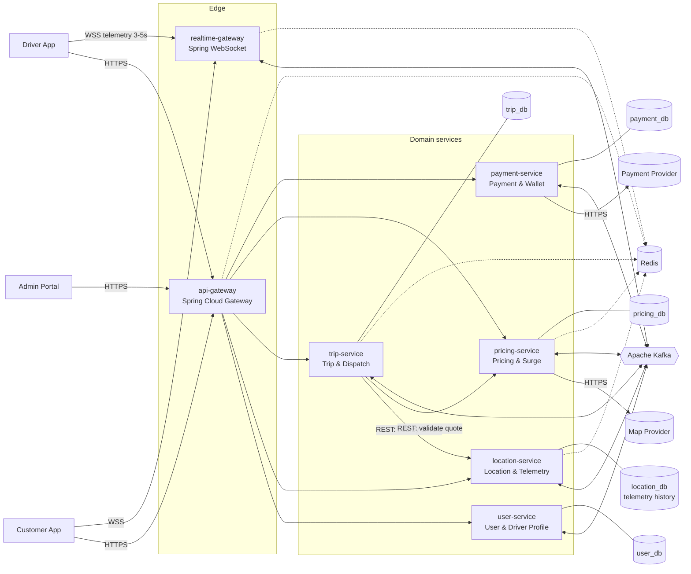
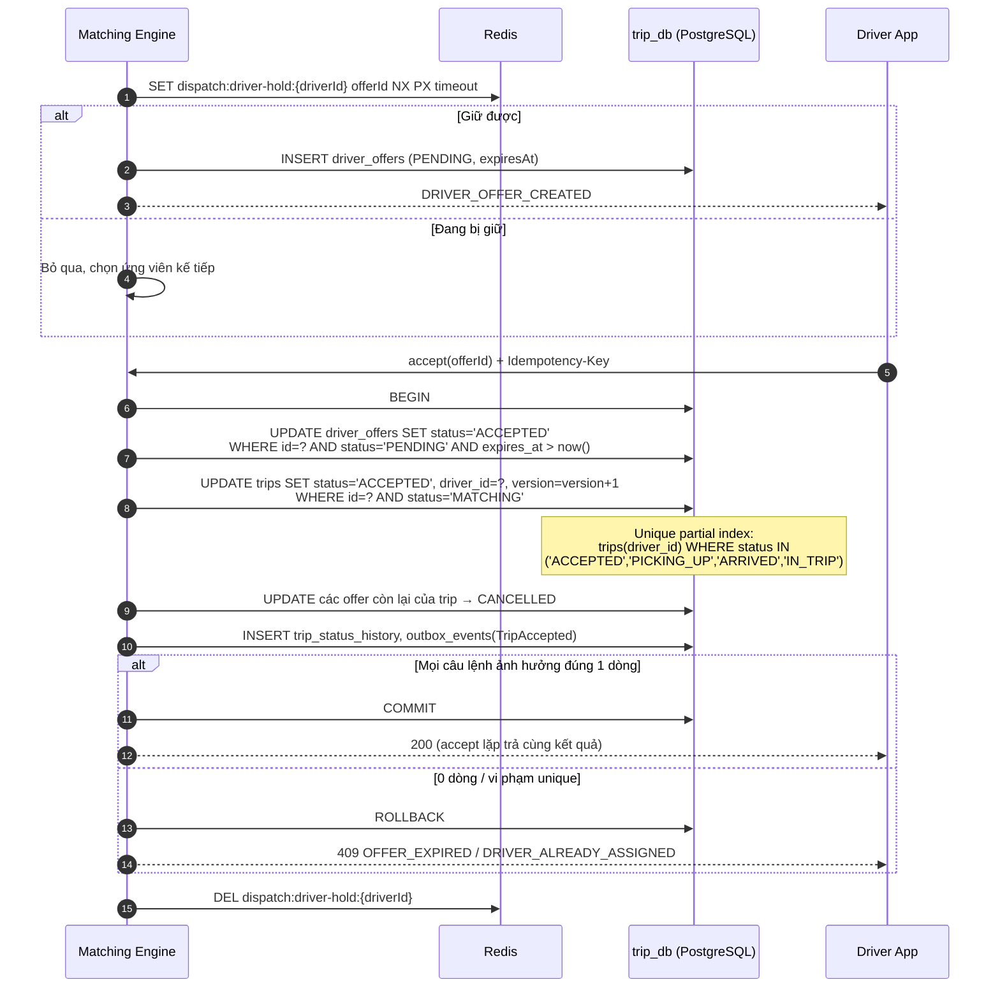
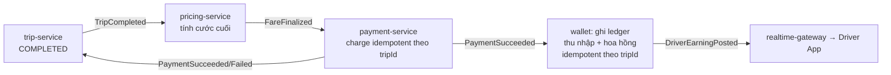
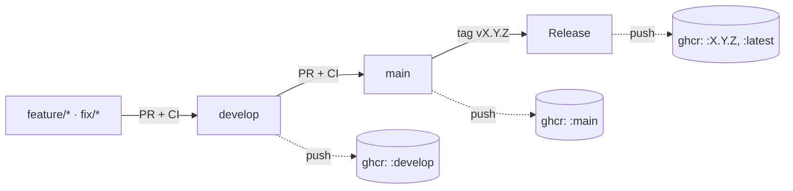
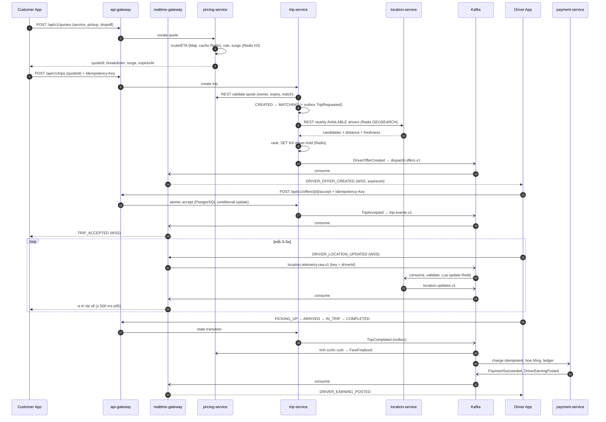
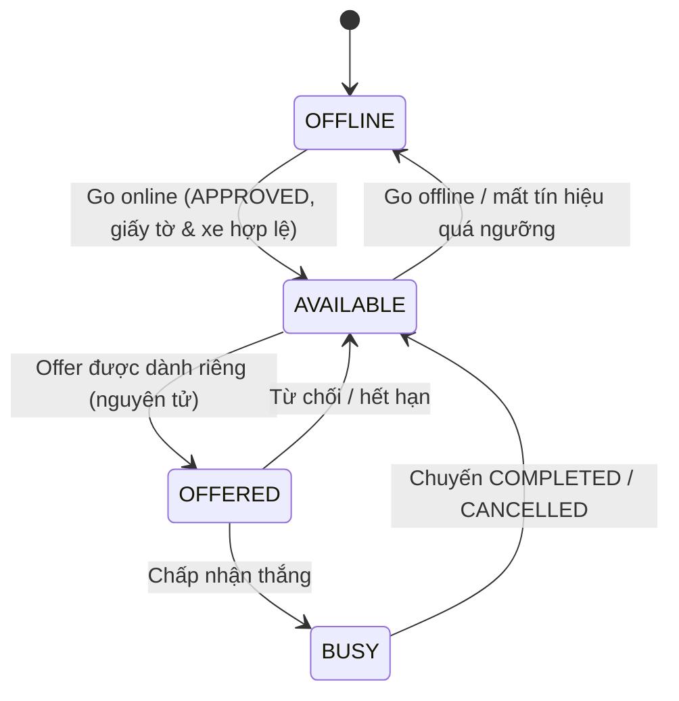
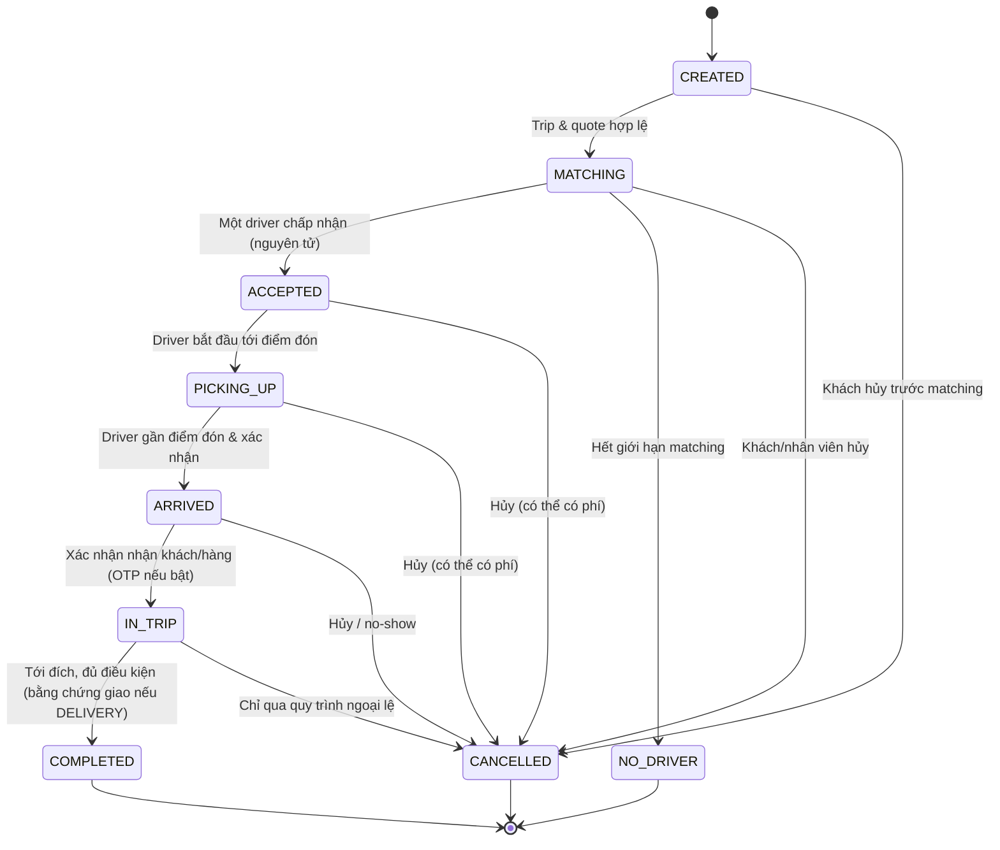

# Ride-Hailing & On-Demand Delivery Platform

> Hệ thống đặt xe và giao hàng theo yêu cầu trong thời gian thực — kiến trúc microservices.
>
> **Stack:** Java 21 · Spring Boot · Redis (cache & GEO) · Apache Kafka · PostgreSQL
>
> **Trạng thái:** Đang triển khai. Đã có nền tảng (parent POM, `libs/`, `contracts/`, docker-compose), `api-gateway` và `user-service` — xem [§4.13](#413-chạy-local-và-tiến-độ).
>
> Tài liệu nguồn: **SRS-RHL-002 v1.0** (theo IEEE 830-1998). README này tóm tắt SRS để cả nhóm nắm nhanh phạm vi, kiến trúc, quy tắc nghiệp vụ và tiêu chí nghiệm thu. Khi có mâu thuẫn, **SRS là nguồn sự thật**.

---

## Mục lục

1. [Tổng quan](#1-tổng-quan)
2. [Phạm vi phiên bản 1.0](#2-phạm-vi-phiên-bản-10)
3. [Tác nhân và phân quyền](#3-tác-nhân-và-phân-quyền)
4. [Kiến trúc microservices](#4-kiến-trúc-microservices)
5. [Luồng nghiệp vụ chính](#5-luồng-nghiệp-vụ-chính)
6. [State machine chuyến](#6-state-machine-chuyến)
7. [Yêu cầu chức năng theo miền](#7-yêu-cầu-chức-năng-theo-miền)
8. [Hợp đồng giao tiếp](#8-hợp-đồng-giao-tiếp)
9. [Domain events](#9-domain-events)
10. [Dữ liệu](#10-dữ-liệu)
11. [Yêu cầu phi chức năng](#11-yêu-cầu-phi-chức-năng)
12. [Quy tắc nghiệp vụ](#12-quy-tắc-nghiệp-vụ)
13. [Use case và nghiệm thu](#13-use-case-và-nghiệm-thu)
14. [Chiến lược kiểm thử](#14-chiến-lược-kiểm-thử)
15. [Vấn đề còn mở (TBD)](#15-vấn-đề-còn-mở-tbd)
16. [Thuật ngữ](#16-thuật-ngữ)

---

## 1. Tổng quan

Nền tảng kết nối **khách hàng** với **tài xế** cho hai loại dịch vụ:

| Dịch vụ | Mô tả |
|---|---|
| **RIDE** — Chở khách | Khách yêu cầu chuyến từ điểm đón → điểm đến, nhận báo giá, được ghép tài xế, theo dõi chuyến và thanh toán. |
| **DELIVERY** — Giao hàng | Người gửi cung cấp điểm lấy, điểm giao, thông tin người nhận và kiện hàng; tài xế nhận, vận chuyển và xác nhận giao. |

**Năng lực cốt lõi:**

- Quản lý tài khoản khách hàng, hồ sơ tài xế, phương tiện, giấy phép.
- Thu nhận GPS tài xế mỗi **3–5 giây** và lập chỉ mục không gian.
- Matching tài xế gần nhất, phù hợp; **chống gán trùng** (một tài xế ↔ một chuyến).
- Vòng đời chuyến theo **state machine nghiêm ngặt**.
- Báo giá theo quãng đường/thời gian + **giá động (surge)** theo cung/cầu khu vực.
- Theo dõi vị trí và trạng thái qua **WebSocket**.
- Thanh toán, hoa hồng nền tảng, **ví tài xế dạng ledger bất biến**.

---

## 2. Phạm vi phiên bản 1.0

### Trong phạm vi

- Một quốc gia, một tiền tệ (**VND**).
- Mỗi chuyến có **1 điểm đón/lấy** và **1 điểm đến/giao**.
- Một tài xế tối đa **1 chuyến hoạt động** tại một thời điểm.
- Tối thiểu một phương thức thanh toán điện tử (sandbox).
- Kiểm duyệt hồ sơ tài xế thủ công bởi nhân viên.

### Ngoài phạm vi

Đi chung xe · đặt lịch trước · nhiều điểm dừng · đội xe doanh nghiệp / vận tải đường dài · gom đơn / tối ưu tuyến nhiều đơn · đấu giá cước · coupon / loyalty · bảo hiểm chuyến · sinh trắc học / kiểm tra lý lịch tự động · tính lương & thuế tài xế · gọi che số / chat đa phương tiện · trung tâm ứng cứu khẩn cấp · đa quốc gia / đa tiền tệ / đa ngôn ngữ · rút tiền khỏi ví (TBD) · chống giả lập vị trí nâng cao.

---

## 3. Tác nhân và phân quyền

RBAC tối thiểu: `Customer`, `Driver`, `Reviewer`, `SupportStaff`, `FinanceStaff`, `Administrator`.

| Tác nhân | Quyền chính |
|---|---|
| Khách vãng lai | Đăng ký, đăng nhập, xem thông tin công khai |
| Khách hàng | Hồ sơ, lấy báo giá, đặt/hủy chuyến, theo dõi, thanh toán, xem lịch sử |
| Tài xế chờ duyệt | Hoàn thiện hồ sơ, theo dõi trạng thái xét duyệt |
| Tài xế hoạt động | Online/Offline, gửi vị trí, nhận/từ chối offer, cập nhật chuyến, xem ví |
| Nhân viên kiểm duyệt | Duyệt / từ chối / yêu cầu bổ sung hồ sơ tài xế |
| Nhân viên hỗ trợ | Tra cứu chuyến, xem lịch sử, hủy ngoại lệ (có audit) |
| Nhân viên tài chính | Xem thanh toán, ví, hoa hồng; hoàn tiền |
| Quản trị viên | Quản lý vai trò/quyền, bảng giá, phạm vi dịch vụ |
| Map Provider *(máy)* | Geocoding, tuyến đường, khoảng cách, ETA |
| Payment Provider *(máy)* | Xử lý thanh toán, callback kết quả, hoàn tiền |

> Mọi endpoint/bản tin được bảo vệ **phải** kiểm tra danh tính, quyền và **quyền sở hữu tài nguyên** phía server (FR-IAM-010, NFR-SEC-004).

---

## 4. Kiến trúc microservices

### 4.1. Stack công nghệ đã chốt

| Lớp | Công nghệ | Vai trò trong hệ thống |
|---|---|---|
| Ngôn ngữ / framework | **Java 21 (LTS) + Spring Boot 3.5 + Spring Cloud 2025.0** | Nền tảng cho mọi service |
| API Gateway | Spring Cloud Gateway | Định tuyến, xác thực JWT, rate limit, gắn correlation ID |
| Realtime | Spring WebSocket | Kênh WSS cho telemetry, offer, trạng thái chuyến |
| Bảo mật | Spring Security (OAuth2 Resource Server, JWT) | AuthN/AuthZ, RBAC, kiểm tra quyền sở hữu tài nguyên |
| Gọi đồng bộ giữa service | Spring `RestClient` / OpenFeign + Resilience4j | REST nội bộ có timeout, retry giới hạn, circuit breaker |
| Truy cập dữ liệu | Spring Data JPA + Flyway | ORM, optimistic locking (`@Version`), migration có version |
| **Cache & dữ liệu không gian** | **Redis** (Spring Data Redis / Lettuce) | GEO index tài xế, vị trí mới nhất có TTL, khóa phân tán, rate limit, cache quote, bộ đếm surge, registry phiên WebSocket |
| **Event streaming** | **Apache Kafka** (Spring for Apache Kafka) | Domain event giữa các service, telemetry stream, retry và DLT |
| Ô không gian | Uber H3 (`h3-java`) | Chia vùng tính surge cung/cầu |
| Tài liệu API | springdoc-openapi | Sinh OpenAPI cho REST |
| **Schema event** | **JSON + JSON Schema (draft 2020-12)** | Hợp đồng event trong `contracts/events/`, validate bằng `networknt json-schema-validator` |
| Kiểm thử | JUnit 5, Mockito, Testcontainers (Kafka, Redis, DB), Awaitility | Unit, integration, concurrency test |
| **CSDL quan hệ** | **PostgreSQL** (Spring Data JPA + Flyway) | Nguồn sự thật cho dữ liệu nghiệp vụ, mỗi service một database riêng |

> **Nguyên tắc phân vai:** **PostgreSQL** là nguồn sự thật. **Redis** chỉ giữ dữ liệu dẫn xuất hoặc ngắn hạn: mất Redis thì phải tái tạo được (DR-GEO-005). **Kafka** là kênh tích hợp bất đồng bộ duy nhất giữa các service (CON-02, NFR-MNT-004).

### 4.2. Sơ đồ kiến trúc



### 4.3. Danh sách service

Thành phần logic **API & WebSocket Gateway** trong SRS được tách thành hai deployable: `api-gateway` cho HTTP và `realtime-gateway` cho WebSocket. Lý do là hai phần này có cách mở rộng và quản lý phiên khác nhau.

| Service | Port (dự kiến) | Trách nhiệm | Dữ liệu sở hữu (PostgreSQL) | Dùng Redis cho |
|---|---|---|---|---|
| `api-gateway` | 8080 | Định tuyến REST, xác thực JWT, rate limit, correlation ID, CORS | — | Rate limit (token bucket) |
| `user-service` | 8081 | Đăng ký/đăng nhập, phát hành JWT, RBAC, hồ sơ tài xế, phương tiện, giấy tờ, xét duyệt, Online/Offline, audit | `users`, `roles`, `driver_profiles`, `vehicles`, `driver_documents`, `review_decisions`, `audit_records` | Đếm số lần đăng nhập sai, danh sách token bị thu hồi |
| `location-service` | 8082 | Validate telemetry, cập nhật vị trí mới nhất, GEO index, truy vấn tài xế gần | `telemetry_history` (tùy chính sách lưu giữ) | **GEO index**, vị trí mới nhất có TTL, sequence cuối của mỗi tài xế |
| `trip-service` | 8083 | Tạo chuyến, matching engine, offer, state machine, hủy chuyến | `trips`, `trip_stops`, `trip_status_history`, `driver_offers`, `idempotency_keys`, `outbox_events` | Khóa giữ tài xế khi gửi offer, timer hết hạn offer |
| `pricing-service` | 8084 | Bảng giá, gọi Map Provider, surge, quote, cước cuối | `pricing_rules`, `surge_rules`, `surge_snapshots`, `fare_quotes`, `final_fares`, `outbox_events` | Cache quote, bộ đếm cung/cầu theo ô H3, hệ số surge hiện hành, cache tuyến đường |
| `realtime-gateway` | 8085 | Quản lý phiên WSS, xác thực, heartbeat, subscribe theo quyền, đẩy bản tin xuống client | — | Registry phiên (user → instance), danh sách người tham gia chuyến |
| `payment-service` | 8086 | Thanh toán, callback provider, hoàn tiền, ví, ledger, hoa hồng | `payments`, `payment_attempts`, `refunds`, `wallets`, `wallet_entries`, `commission_rules`, `outbox_events` | Không dùng cho số dư (số dư chỉ lấy từ ledger trong DB) |

### 4.4. Ràng buộc kiến trúc bắt buộc

| Mã | Ràng buộc | Cách hiện thực với stack |
|---|---|---|
| CON-01 | Tách tối thiểu các miền User/Driver, Location, Trip/Dispatch, Pricing, Payment/Wallet | 5 domain service ở §4.3 |
| CON-02 | Database-per-service | Mỗi service có database và user DB riêng; tích hợp chỉ qua REST hoặc Kafka |
| CON-03 | Realtime qua WebSocket | `realtime-gateway` (Spring WebSocket) |
| CON-04 | Spatial index | **Redis GEO** (`GEOADD` / `GEOSEARCH`) |
| CON-05 | State machine chuyến | Lớp domain `TripStateMachine` trong `trip-service`, có bảng chuyển trạng thái tường minh |
| CON-06 | Gán tài xế nguyên tử | Khóa Redis `SET NX` (đường nhanh) + **conditional update và unique partial index trong PostgreSQL** (chốt chặn cuối) |
| CON-07 | Tài chính bất đồng bộ, idempotent | Kafka + Transactional Outbox + bảng `processed_events` |
| CON-08 | Không lưu dữ liệu thẻ | Chỉ lưu token/reference của payment provider |

### 4.5. Thiết kế PostgreSQL

**Tổ chức:** Dev dùng một instance PostgreSQL, mỗi service có **database và user DB riêng**. User của service này không có quyền trên database của service khác (CON-02, DR-002). Schema được quản lý bằng **Flyway** (`V{n}__{mô_tả}.sql`), mỗi lần thay đổi có version (NFR-MNT-006).

| Database | Service | Bảng chính |
|---|---|---|
| `user_db` | user-service | `users`, `user_roles`, `refresh_tokens`, `driver_profiles`, `driver_profile_versions`, `vehicles`, `driver_documents`, `review_decisions`, `driver_availability`, `audit_records`, `outbox_events`, `processed_events` |
| `location_db` | location-service | `telemetry_history` (partition theo ngày, xóa theo chính sách lưu giữ), `processed_events` |
| `trip_db` | trip-service | `trips`, `trip_stops`, `trip_status_history`, `driver_offers`, `delivery_details`, `delivery_proofs`, `idempotency_keys`, `audit_records`, `outbox_events`, `processed_events` |
| `pricing_db` | pricing-service | `pricing_rules`, `surge_rules`, `surge_snapshots`, `fare_quotes`, `final_fares`, `cancellation_fee_rules`, `audit_records`, `outbox_events`, `processed_events` |
| `payment_db` | payment-service | `payments`, `payment_attempts`, `provider_callbacks`, `refunds`, `wallets`, `wallet_entries`, `commission_rules`, `audit_records`, `outbox_events`, `processed_events` |

**Tính năng PostgreSQL dùng cho các yêu cầu then chốt:**

| Yêu cầu | Kỹ thuật PostgreSQL |
|---|---|
| Không gán trùng tài xế (CON-06, NFR-REL-003) | `CREATE UNIQUE INDEX ux_trip_active_driver ON trips(driver_id) WHERE status IN ('ACCEPTED','PICKING_UP','ARRIVED','IN_TRIP')` + `UPDATE ... WHERE status = 'MATCHING'` (kiểm tra số dòng bị ảnh hưởng) |
| Một khách không có nhiều chuyến hoạt động xung đột (FR-TRIP-007) | Unique partial index trên `trips(customer_id)` cho các trạng thái hoạt động (tùy chính sách) |
| Chống lost update (DR-009) | Cột `version` + JPA `@Version` (optimistic locking) |
| Idempotency API (COM-008) | `idempotency_keys(scope, key)` khóa chính, lưu hash payload + response; khác hash → `409 IDEMPOTENCY_KEY_REUSED` |
| Idempotency tài chính (BR-009, BR-015) | `UNIQUE(trip_id)` trên `final_fares`; `UNIQUE(trip_id, attempt_no)` trên `payment_attempts`; `UNIQUE(provider, provider_ref)` trên `provider_callbacks`; `UNIQUE(reference_type, reference_id, entry_type)` trên `wallet_entries` |
| Outbox relay nhiều instance | `SELECT ... FROM outbox_events WHERE status='PENDING' ORDER BY id LIMIT n FOR UPDATE SKIP LOCKED` |
| Consumer idempotent | `processed_events(consumer, event_id)` khóa chính, insert cùng transaction nghiệp vụ |
| Bản ghi bất biến (DR-005, FR-ADM-006) | `trip_status_history`, `wallet_entries`, `audit_records` chỉ `INSERT`: thu hồi quyền `UPDATE/DELETE` của user ứng dụng, hoặc dùng trigger chặn |
| Số dư ví không âm (FR-WAL-009) | Ghi bút toán trong transaction có `SELECT ... FOR UPDATE` trên `wallets`; có thể lưu `balance` dẫn xuất kèm `CHECK (balance >= 0)` và đối soát với tổng ledger |
| Tổng hoàn ≤ đã thu (BR-010) | Khóa dòng `payments` khi tạo refund, kiểm tra `SUM(refunds.amount) + new ≤ captured_amount` |
| Tiền (FR-PRI-016, DR-008) | `BIGINT` (VND) hoặc `NUMERIC(19,4)` cho thành phần trung gian; cột `currency CHAR(3)` |
| Thời gian (DR-007) | `TIMESTAMPTZ`, JVM và kết nối đặt `UTC` |
| Enum trạng thái | `VARCHAR` + `CHECK` constraint (dễ migrate hơn kiểu `ENUM` của PostgreSQL) |
| Payload/snapshot linh hoạt | `JSONB` cho quote snapshot, fare breakdown, audit delta, outbox payload |
| Tra cứu admin (FR-ADM-001, FR-ADM-007) | Index `(status, created_at)`, `(customer_id, created_at)`, `(driver_id, created_at)`; phân trang keyset |
| ID (DR-006) | `UUID` (UUIDv7/ULID, sắp xếp được theo thời gian), không chứa PII; mã chuyến hiển thị riêng |

> Spatial query cho matching dùng **Redis GEO**. PostGIS chưa cần ở v1.0. Nếu sau này cần truy vấn vùng phức tạp, chẳng hạn polygon vùng hoạt động, có thể bật extension PostGIS trên `pricing_db` hoặc `location_db` mà không đổi kiến trúc.

### 4.6. Thiết kế Redis

| Key pattern | Kiểu | TTL | Owner | Mục đích |
|---|---|---|---|---|
| `geo:drivers:{serviceType}` | GEO (sorted set) | — (dọn định kỳ) | location | Tài xế `AVAILABLE` cho matching: `GEOSEARCH ... BYRADIUS ... ASC WITHDIST` |
| `geo:lastseen:{serviceType}` | ZSET (score = serverTs) | — | location | Job dọn định kỳ xóa member quá hạn khỏi GEO (FR-LOC-008) |
| `loc:driver:{driverId}` | HASH `lat,lng,acc,heading,speed,seq,serverTs` | 30 s (cấu hình) | location | Vị trí mới nhất để đẩy realtime và kiểm tra độ mới |
| `loc:seq:{driverId}` | STRING | theo phiên | location | Chặn bản tin trùng hoặc cũ (sequence ≤ giá trị đang lưu thì bỏ); xóa khi tài xế bắt đầu phiên Online mới |
| `loc:avail:{driverId}` | HASH `serviceTypes,vehicleId` | — | location | Chỉ có khi tài xế `AVAILABLE`; Lua đọc key này để quyết định có `GEOADD` hay không, nên cập nhật vị trí và đổi trạng thái không giẫm lên nhau. Dựng lại từ `driver_presence` khi khởi động |
| `dispatch:driver-hold:{driverId}` | STRING = offerId | = timeout offer | trip | Giữ tài xế khi gửi offer (`SET NX PX`), tránh offer cạnh tranh |
| `dispatch:offer-expiry` | ZSET (score = expiresAt) | — | trip | Scheduler quét offer hết hạn |
| `quote:{quoteId}` | STRING (JSON) | = `expiresAt` | pricing | Cache quote; nguồn sự thật vẫn là bảng `fare_quotes` |
| `surge:demand:{serviceType}:{h3Cell}` | ZSET tripId → thời điểm yêu cầu | 2 × cửa sổ | pricing | Đếm cầu theo ô trong cửa sổ trượt; tripId làm member nên event gửi lại không đếm trùng |
| `surge:supply:{serviceType}:{h3Cell}` | ZSET driverId → thời điểm vị trí | 2 × độ mới | pricing | Đếm cung (tài xế AVAILABLE có vị trí còn mới) |
| `surge:driver:{driverId}` | HASH `version,status,services,cell,ts` | 1 ngày (gia hạn khi có event) | pricing | Trạng thái và ô hiện tại của tài xế; Lua bỏ event có version/thời điểm cũ. Hệ số surge tính lúc tạo quote (không cache) và ghi lại trên quote cùng số cung/cầu, ô H3, version quy tắc |
| `route:{hash(from,to,type)}` | STRING | vài phút | pricing | Cache kết quả Map Provider |
| `ws:session:{userId}` | SET instanceId | theo heartbeat | realtime | Biết phiên đang ở instance nào |
| `ws:trip-participants:{tripId}` | HASH | đến hết thời gian ân hạn | realtime | Kiểm tra quyền subscribe nhanh (dựng lại từ `trip.events`) |
| `rl:{endpoint}:{principal}` | token bucket | ngắn | api-gateway | Rate limit (NFR-SEC-007) |
| `auth:login-fail:{identifier}` | STRING (INCR) | cửa sổ khóa | user | Giới hạn đăng nhập sai (FR-IAM-006) |
| `auth:revoked:{jti}` | STRING | = thời hạn token còn lại | user, gateway | Thu hồi phiên/token (FR-IAM-007) |

**Lưu ý:**

- Redis GEO không có TTL cho từng member, nên độ mới được bảo đảm theo hai lớp: (1) job dọn dựa trên `geo:lastseen`, (2) khi truy vấn, kiểm tra lại `loc:driver:{id}` còn tồn tại và `serverTs` còn trong ngưỡng.
- Tài xế chỉ có mặt trong `geo:drivers:*` khi `AVAILABLE`. Location service cập nhật tập này chỉ từ `DriverAvailabilityChanged`: `user-service` chuyển các event offer/chuyến của trip-service thành `OFFERED`/`BUSY`/`AVAILABLE` rồi phát lại, nên trạng thái tài xế chỉ có một nguồn và một dãy `aggregateVersion`.
- Cập nhật vị trí và kiểm tra sequence chạy trong **một Lua script** để nguyên tử: so sánh `seq`, ghi `HSET`, `GEOADD`, `ZADD`.
- Không lưu số dư ví, trạng thái chuyến hay kết quả thanh toán **chỉ** trong Redis.

### 4.7. Thiết kế Kafka

#### Topic

Mỗi topic tương ứng một aggregate. **Message key = ID của aggregate** để giữ thứ tự sự kiện của cùng một chuyến hoặc tài xế trên cùng partition.

| Topic | Key | Producer | Consumer group | Event |
|---|---|---|---|---|
| `driver.events.v1` | driverId | user-service | location, trip, pricing, realtime | `DriverAvailabilityChanged`, `DriverApproved`, `DriverSuspended` |
| `location.telemetry.raw.v1` | driverId | realtime-gateway | location | Bản tin `DRIVER_LOCATION_UPDATED` thô từ tài xế |
| `location.updates.v1` | driverId | location | realtime, pricing | `DriverLocationUpdated` (đã validate) |
| `trip.events.v1` | tripId | trip | realtime, pricing, payment, user | `TripRequested`, `TripAccepted`, `TripStatusChanged`, `TripCompleted`, `TripCancelled` |
| `dispatch.offers.v1` | driverId | trip | realtime, user | `DriverOfferCreated`, `DriverOfferExpired`, `DriverOfferDeclined`, `DriverOfferCancelled` |
| `pricing.events.v1` | tripId | pricing | payment, trip | `FareFinalized`, `CancellationFeeCalculated` |
| `payment.events.v1` | tripId | payment | trip, realtime | `PaymentSucceeded`, `PaymentFailed`, `RefundCompleted` |
| `wallet.events.v1` | driverId | payment | realtime | `DriverEarningPosted`, `WalletAdjusted` |
| `<topic>.DLT` | như topic gốc | Spring Kafka (`common-messaging` đặt tên rõ ràng, cùng partition với bản ghi lỗi) | admin tool | Event không xử lý được (FR-EVT-008) |

Loại event được ghi trong header `eventType` và trong envelope (§9). Topic có hậu tố `.v1`; thay đổi không tương thích sẽ tạo topic `.v2` (NFR-MNT-002).

#### Schema event: JSON Schema

Event được serialize bằng **JSON (UTF-8)** và mô tả bằng **JSON Schema (draft 2020-12)**. Các file schema nằm trong `contracts/events/` và là nguồn sự thật cho mọi producer và consumer. Hệ thống không dùng Avro hay Schema Registry.

```
contracts/events/
├── envelope.v1.schema.json                 # eventId, eventType, eventVersion, occurredAt,
│                                           # correlationId, producer, aggregateId, aggregateVersion, payload
├── driver/
│   └── DriverAvailabilityChanged.v1.schema.json
├── trip/
│   ├── TripRequested.v1.schema.json
│   ├── TripAccepted.v1.schema.json
│   ├── TripStatusChanged.v1.schema.json
│   ├── TripCompleted.v1.schema.json
│   └── TripCancelled.v1.schema.json
├── dispatch/                               # DriverOfferCreated/Expired/Declined/Cancelled
├── pricing/FareFinalized.v1.schema.json
├── payment/PaymentSucceeded.v1.schema.json
├── wallet/DriverEarningPosted.v1.schema.json
└── examples/                               # Payload mẫu hợp lệ, dùng cho contract test
```

| Quy ước | Nội dung |
|---|---|
| Đặt tên file | `<EventType>.v<eventVersion>.schema.json`; `$id` = `urn:rhl:event:<EventType>:v<n>` |
| Kiểu dữ liệu | ID là `string` (format `uuid`); thời gian là `string` (format `date-time`, UTC); tiền là `integer` (VND) kèm `currency`; trạng thái là `enum` |
| Trường bắt buộc | Khai báo trong `required`; producer **không xóa hoặc đổi nghĩa** trường bắt buộc trong cùng version (NFR-COMP-002) |
| Trường mở rộng | Schema của payload để `additionalProperties: true`; consumer bỏ qua trường lạ (`FAIL_ON_UNKNOWN_PROPERTIES = false`) |
| Thay đổi tương thích | Thêm trường tùy chọn: giữ nguyên `eventVersion` và cập nhật file schema hiện tại |
| Thay đổi không tương thích | Tạo `eventVersion` mới (file `.v2`). Producer phát song song v1 và v2 trong thời gian chuyển đổi, hoặc dùng topic `.v2` (NFR-MNT-002) |
| Kiểm tra lúc chạy | Producer validate payload theo schema **trước khi ghi outbox**; consumer validate khi nhận, payload sai → không retry, chuyển thẳng `<topic>.DLT` |
| Thư viện | `com.networknt:json-schema-validator` + Jackson; schema được đóng gói vào jar từ `contracts/` lúc build |
| Sinh code (tùy chọn) | `jsonschema2pojo` sinh Java record/POJO từ schema, tránh viết tay lệch hợp đồng |
| Contract test | CI validate `examples/` theo schema; test của từng consumer dùng payload mẫu của producer (NFR-MNT-001, Phụ lục C) |

Bản tin WebSocket (Phụ lục A của SRS) cũng theo cách này, schema đặt trong `contracts/websocket/`.

#### Bảo đảm giao nhận

| Vấn đề | Giải pháp |
|---|---|
| Ghi DB + phát event nguyên tử (FR-EVT-002) | **Transactional Outbox**: insert `outbox_events` trong cùng transaction nghiệp vụ; relay `@Scheduled` đọc theo lô (`FOR UPDATE SKIP LOCKED`), gửi Kafka, đánh dấu `SENT` |
| Producer không tạo bản ghi trùng | `acks=all`, `enable.idempotence=true` |
| Consumer idempotent (FR-EVT-004) | Bảng `processed_events(consumer, event_id)` có khóa chính, insert trong cùng transaction với thay đổi nghiệp vụ; trùng thì bỏ qua |
| Commit offset | `enable-auto-commit=false`, ack sau khi transaction DB commit |
| Lỗi tạm thời (FR-EVT-005) | `DefaultErrorHandler` + `ExponentialBackOff` có số lần giới hạn |
| Lỗi nghiệp vụ / poison message | Đánh dấu exception không retry → `DeadLetterPublishingRecoverer` → `<topic>.DLT` |
| Event sai thứ tự (FR-EVT-006) | Payload có `aggregateVersion`; consumer bỏ event có version ≤ version đã áp dụng hoặc không hợp lệ theo state machine |
| Payment/Wallet down (FR-EVT-007) | Event nằm lại trong Kafka; consumer xử lý tiếp từ offset đã commit khi service hoạt động lại |
| Xử lý lại (FR-EVT-008) | Endpoint admin đọc DLT, cho người có quyền replay hoặc đánh dấu đã bù |

**Telemetry không đi qua outbox.** Đây là dữ liệu tần suất cao và ngắn hạn, nên `realtime-gateway` publish trực tiếp vào `location.telemetry.raw.v1`. Producer telemetry dùng `linger.ms` nhỏ để giữ độ trễ ≤ 500 ms; topic này có retention ngắn.

#### Fan-out realtime khi chạy nhiều instance

Mỗi instance `realtime-gateway` consume `location.updates`, `trip.events`, `dispatch.offers`, `payment.events`, `wallet.events` bằng **consumer group riêng** (`realtime-{instanceId}`), tức là mọi instance đều nhận mọi bản tin. Mỗi instance chỉ đẩy xuống các phiên đang kết nối với chính nó. Quy mô nghiệm thu (100 tài xế × 3 s ≈ 33 msg/s) phù hợp với cách này. Khi tải tăng, có thể chuyển sang định tuyến qua Redis Pub/Sub theo `ws:session:{userId}`.

### 4.8. Chống gán trùng tài xế (CON-06, UC-06)



- **PostgreSQL là chốt chặn cuối:** conditional update và unique partial index bảo đảm đúng ngay cả khi khóa Redis hết hạn hoặc Redis gặp sự cố.
- Offer hết hạn được quét từ `dispatch:offer-expiry` (có đối chiếu DB), sau đó giải phóng khóa giữ, phát `DriverOfferExpired` và chuyển sang ứng viên kế tiếp.
- **Trạng thái tài xế:** `OFFLINE` và `AVAILABLE` do `user-service` quyết định (kiểm tra điều kiện Online). `OFFERED` và `BUSY` được quyết định nguyên tử tại `trip-service`, nơi diễn ra giao dịch accept. `user-service` cập nhật projection trạng thái qua `trip.events` / `dispatch.offers` (gắn với đúng `offerId`/`tripId` vì hai topic không có thứ tự với nhau) và phát `DriverAvailabilityChanged` cho location-service.

### 4.9. Luồng dữ liệu tài chính qua Kafka



- Ràng buộc idempotent theo nghiệp vụ: `UNIQUE(trip_id)` trên `final_fares`, `UNIQUE(trip_id, attempt_no)` trên `payment_attempts`, `UNIQUE(reference_type, reference_id, entry_type)` trên `wallet_entries`.
- Tiền lưu bằng `BIGINT` (VND, đơn vị nhỏ nhất) hoặc `NUMERIC(19,0)`; trong Java dùng `long` hoặc `BigDecimal`, **không dùng `double`**.

### 4.10. Cấu trúc mã nguồn dự kiến

```
ride-hailing-logistics/
├── .github/                        # CI/CD (§4.12), Dependabot, CODEOWNERS, PR template
├── docker/service.Dockerfile       # Dockerfile dùng chung cho mọi service
├── pom.xml                         # Parent POM: Spring Boot BOM, Spring Cloud BOM, plugin chung
├── contracts/                      # Hợp đồng là nguồn sự thật cho giao tiếp
│   ├── openapi/                    #   *.yaml cho từng service
│   ├── events/                     #   JSON Schema (draft 2020-12) cho từng event + version
│   └── websocket/                  #   Schema bản tin realtime (Phụ lục A SRS)
├── libs/                           # Chỉ hạ tầng dùng chung, KHÔNG chứa domain model
│   ├── common-web/                 #   Error envelope, @ControllerAdvice, CorrelationIdFilter
│   ├── common-security/            #   JWT converter, RBAC helper
│   └── common-messaging/           #   Event envelope, Outbox relay, idempotent consumer
├── services/
│   ├── api-gateway/
│   ├── realtime-gateway/
│   ├── user-service/
│   ├── location-service/
│   ├── trip-service/
│   ├── pricing-service/
│   └── payment-service/
├── tools/
│   └── driver-simulator/           # Giả lập 100 tài xế gửi GPS mỗi 3 s (UC-09)
└── docker-compose.yml              # Kafka (KRaft), Redis, PostgreSQL cho môi trường dev
```

Cấu trúc package bên trong mỗi service:

```
com.rhl.<service>/
├── api/              # REST controller, WebSocket handler, DTO request/response
├── application/      # Use case, điều phối transaction, kiểm tra quyền
├── domain/           # Entity, value object, state machine, quy tắc nghiệp vụ (không phụ thuộc Spring)
└── infrastructure/
    ├── persistence/  # JPA entity/repository, Flyway migration
    ├── messaging/    # Kafka producer/consumer, outbox
    ├── cache/        # Redis adapter
    └── client/       # REST client tới service khác / provider bên ngoài
```

### 4.11. Môi trường dev dự kiến

| Thành phần | Port | Ghi chú |
|---|---|---|
| Kafka (KRaft, không Zookeeper) | 19092 | Tự tạo topic bằng `NewTopic` bean hoặc script khởi tạo |
| Redis | 16379 | Bật AOF tùy chọn; dữ liệu phải tái tạo được |
| PostgreSQL | 15432 | Một instance, mỗi service một database (`user_db`, `trip_db`, ...); user `<service>_svc`, mật khẩu trùng tên (chỉ dev) |
| MinIO (S3) | 19000 (API), 19001 (console) | File giấy tờ tài xế (bucket riêng tư `rhl-driver-documents`, user-service tự tạo khi khởi động); image `cgr.dev/chainguard/minio` vì MinIO không còn phát hành image công khai; tài khoản dev `rhl-dev` / `rhl-dev-secret` |
| Kafka UI (tùy chọn) | 8090 | Quan sát topic, DLT |

> Port phía host cố ý tránh mặc định (5432/6379/9092) để không đụng PostgreSQL cài sẵn hay stack khác; đổi bằng `RHL_POSTGRES_PORT`, `RHL_REDIS_PORT`, `RHL_KAFKA_PORT` (khi đổi, đặt thêm `USER_DB_URL`, `REDIS_PORT`, `KAFKA_BOOTSTRAP_SERVERS` cho service).

Các tham số nghiệp vụ được khai báo trong `application.yml` và **không hard-code** trong code (NFR-MNT-005). Ví dụ:

```yaml
rhl:
  telemetry:
    interval-seconds: 3
    location-ttl-seconds: 30
    max-accuracy-meters: 50
  matching:
    initial-radius-meters: 2000
    radius-step-meters: 1000
    max-radius-meters: 8000
    offer-timeout-seconds: 15
    matching-timeout-seconds: 30
  quote:
    ttl-seconds: 300
  surge:
    h3-resolution: 8
    window-seconds: 300
    min-multiplier: 1.0
    max-multiplier: 3.0
```

> Các giá trị trên chỉ là placeholder cho dev. Giá trị chính thức chờ chốt ở TBD-04, TBD-05, TBD-06, TBD-14.

### 4.12. CI/CD (GitHub Actions)

#### Quy trình nhánh



- Nhánh tính năng tách từ `develop`, merge vào `develop` qua PR bằng **squash merge**. Phát hành bằng PR `develop → main` dùng **merge commit** (không squash/rebase, để hai nhánh giữ chung lịch sử), sau đó gắn tag `vX.Y.Z` trên `main`.
- Tiêu đề PR theo **Conventional Commits** (`feat(trip): ...`, `fix(payment): ...`) vì squash merge dùng tiêu đề PR làm commit message.

#### Workflow

| File | Kích hoạt | Nội dung |
|---|---|---|
| `ci.yml` | PR vào `develop`/`main`; được `delivery.yml` gọi lại | Phát hiện module thay đổi → `mvn verify` (unit + integration test, Testcontainers) chỉ cho service bị ảnh hưởng → báo cáo test và JaCoCo → validate JSON Schema và OpenAPI trong `contracts/` → actionlint + shellcheck → build thử Docker image. Job **`CI passed`** tổng hợp kết quả để dùng làm required check |
| `security.yml` | PR, push `develop`/`main`, thứ Hai hằng tuần, chạy tay | CodeQL (`security-extended`) cho Java và chính các workflow · Dependency Review (chặn CVE mức high và license GPL/AGPL) · gitleaks quét secret · Trivy quét dependency, misconfig, secret; kết quả đẩy lên tab **Security** |
| `delivery.yml` | Push `develop`/`main`, tag `v*.*.*`, chạy tay | Chạy CI → build image cho service thay đổi → push **GHCR** `ghcr.io/chuongpham2004/rhl-<service>` kèm SBOM và SLSA provenance → Trivy quét image (fail nếu có CRITICAL/HIGH đã có bản vá) → ký **cosign keyless** → tag tạo GitHub Release với release notes tự sinh |
| `pr-quality.yml` | PR | Kiểm tra tiêu đề PR theo Conventional Commits và scope (`trip`, `payment`, ...) |
| `dependabot.yml` | Thứ Hai hằng tuần | Cập nhật Maven, GitHub Actions, Docker base image theo nhóm; PR nhắm vào `develop` |

#### Nguyên tắc

- **Build theo thay đổi:** chỉ build và publish service có file thay đổi. Thay đổi ở `pom.xml`, `libs/`, `contracts/`, `docker/`, `.github/` sẽ build lại toàn bộ (`.github/scripts/detect-changes.sh`).
- **Supply chain:**
  - Mọi action được pin theo **commit SHA**.
  - `GITHUB_TOKEN` mặc định chỉ có quyền `contents: read`; job nào cần thêm quyền thì khai báo riêng.
  - Checkout không giữ credential.
  - Image có SBOM, provenance và chữ ký cosign.
- **Image:** dùng chung `docker/service.Dockerfile` với các bước build Maven, tách layer Spring Boot, chạy trên JRE 21, user không phải root (UID 10001), múi giờ UTC.
- **Khi chưa có code:** các job Maven, contracts và Docker tự bỏ qua; pipeline vẫn xanh.

#### Quy ước để pipeline nhận diện đúng

| Quy ước | Ví dụ |
|---|---|
| Mỗi service là một Maven module tại `services/<name>/pom.xml` | `services/trip-service/pom.xml` |
| Root `pom.xml` là parent/aggregator; có `mvnw` thì CI ưu tiên dùng | `./mvnw verify` |
| Integration test đặt tên `*IT.java` (Failsafe); ngưỡng coverage đặt trong JaCoCo `check` của parent POM | `TripAcceptConcurrencyIT` |
| Schema: `<Name>.v<n>.schema.json`; payload mẫu: `<Name>.v<n>.example.json` | `TripAccepted.v1.example.json` |
| OpenAPI đặt tại `contracts/openapi/*.yaml` | `contracts/openapi/trip-service.yaml` |

#### Thiết lập trên GitHub (làm một lần)

1. **Branch protection `main`** *(đã bật)*: bắt buộc PR (0 approval vì nhóm hiện có một người), required checks `CI passed`, `Conventional PR title`, `Dependency review`, nhánh phải cập nhật trước khi merge, phải giải quyết hết comment, áp dụng cả với admin, cấm force push và xóa nhánh. Không bật *linear history* vì PR `develop → main` dùng merge commit. Khi nhóm đông hơn, tăng số approval và bật *Require review from Code Owners*. **Lưu ý:** comment do bot code scanning (CodeQL, Trivy) để lại trên PR cũng tính là conversation. Phải resolve hết, hoặc sửa/dismiss cảnh báo trong tab Security, thì mới merge được.
   - **Branch protection `develop`** *(đã bật, mức tối thiểu)*: chỉ cấm xóa nhánh và force push; vẫn cho push thẳng, không bắt buộc PR hay check. Lớp bảo vệ này **bắt buộc phải có** vì GitHub tự xóa nhánh nguồn sau khi merge, và `develop` là nhánh nguồn của PR `develop → main`. Nhánh được bảo vệ sẽ không bị tự xóa. Khi nhóm đông hơn, nên nâng lên: bắt buộc PR và check `CI passed`.
2. **Settings → Code security:** bật Dependabot alerts và security updates, secret scanning, push protection.
3. **Settings → General → Pull Requests:** bật *Squash merging* (cho PR vào `develop`) và *Merge commits* (cho PR `develop → main`), tắt *Rebase merging*, bật tự xóa nhánh sau khi merge (an toàn với `develop` nhờ lớp bảo vệ ở bước 1).
4. **Packages:** sau lần publish đầu tiên, liên kết package GHCR với repo và đặt visibility phù hợp.

> **Chưa có bước deploy.** SRS (§1.1) không đưa hạ tầng triển khai vào phạm vi. Khi chọn được môi trường (Kubernetes, VPS + Docker Compose, cloud PaaS, ...), thêm job `deploy` vào `delivery.yml`, gắn GitHub Environments `staging` (từ `develop`) và `production` (từ tag, yêu cầu người duyệt), và deploy theo **digest** đã ký.


### 4.13. Chạy local và tiến độ

```bash
# 1. Hạ tầng: PostgreSQL :15432 (user_db, trip_db, ... + user riêng), Redis :16379, Kafka :19092
docker compose up -d

# 2. Build + unit test + integration test (Testcontainers, cần Docker đang chạy)
./mvnw verify

# 3. Cài libs/ vào ~/.m2 để chạy từng service (làm lại mỗi khi sửa libs/)
./mvnw install -DskipTests -pl libs/common-web,libs/common-security,libs/common-messaging -am

# 4. Chạy service (mỗi lệnh một terminal). Không thêm -am: Maven sẽ cố chạy cả libs/ và báo lỗi thiếu main class.
BOOTSTRAP_ADMIN_EMAIL=admin@rhl.local BOOTSTRAP_ADMIN_PASSWORD=admin-password-123   ./mvnw -pl services/user-service spring-boot:run   # :8081
./mvnw -pl services/location-service spring-boot:run # :8082
./mvnw -pl services/trip-service spring-boot:run     # :8083 (cần location-service để ghép tài xế)
./mvnw -pl services/pricing-service spring-boot:run  # :8084
./mvnw -pl services/payment-service spring-boot:run  # :8086
./mvnw -pl services/realtime-gateway spring-boot:run # :8085, WebSocket ws://localhost:8085/ws
./mvnw -pl services/api-gateway spring-boot:run      # :8080, gọi API qua gateway
```

- **Không tạo bảng bằng tay.** Khi service khởi động, Flyway chạy các file `src/main/resources/db/migration/V{n}__*.sql` chưa chạy (lịch sử trong `flyway_schema_history`), rồi Hibernate chỉ đối chiếu entity với schema (`ddl-auto: validate`). Đổi schema = thêm file `V{n+1}__...sql`; không sửa migration đã chạy ở môi trường nào.
- Entity dùng Lombok giới hạn: `@Getter` + `@NoArgsConstructor(access = PROTECTED)`; bean Spring dùng `@RequiredArgsConstructor`. `@Data`, `@Setter`, `@EqualsAndHashCode`, `@ToString` bị chặn trong `lombok.config` (proxy Hibernate, lazy loading, lộ PII qua log, bỏ qua quy tắc nghiệp vụ).
- Admin đầu tiên được tạo khi khởi động nếu đặt `BOOTSTRAP_ADMIN_EMAIL` và `BOOTSTRAP_ADMIN_PASSWORD` (≥ 12 ký tự); vai trò nhân viên không tự đăng ký được.
- Xác minh liên hệ: `POST /api/v1/users/me/contacts/{email|phone}/verification` gửi mã 6 số tới địa chỉ trên tài khoản (→ 202, địa chỉ được che, `expiresInSeconds`, `resendAfterSeconds`), rồi `POST …/verification/confirm {"code"}` (→ hồ sơ có `emailVerified`/`phoneVerified`). Mã sống `rhl.verification.code-ttl` (10 phút), sai `max-attempts` (5) lần thì hủy, gửi lại sau `resend-cooldown` (60 s), tối đa `max-sends-per-hour` (5); mã chỉ lưu dạng băm trong Redis (`auth:otp:*`) và gắn với địa chỉ. Tài xế phải xác minh ít nhất email hoặc SĐT trước khi nộp hồ sơ (tạm thời, chờ TBD-11).
- Quên mật khẩu: `POST /api/v1/auth/password-reset {"identifier"}` luôn trả cùng một câu 202, dù tài khoản có tồn tại hay không; mã chỉ gửi khi có tài khoản đang hoạt động. `POST /api/v1/auth/password-reset/confirm {"identifier","code","newPassword"}` → 204: đặt mật khẩu mới, đánh dấu địa chỉ nhận mã là đã xác minh, thu hồi mọi refresh token (access token đã cấp tự hết hạn sau tối đa 15 phút). Đăng ký và yêu cầu đặt lại bị giới hạn theo IP client (`rhl.rate-limits.*`, mặc định 10/giờ → 429); IP lấy từ `X-Forwarded-For` do api-gateway thêm (gateway cần `GATEWAY_TRUSTED_PROXIES`, user-service chỉ tin proxy trong mạng nội bộ).
- Chưa có nhà cung cấp email/SMS: `NOTIFICATION_SENDER=log` (mặc định) ghi mã ra log user-service (`DEV NOTIFICATION … code 123456`), **chỉ dùng cho dev**; giá trị khác làm service không khởi động được cho tới khi có provider thật.
- File giấy tờ: tài xế `POST /api/v1/drivers/me/documents/files` (multipart, trường `file`; JPEG/PNG/PDF ≤ `rhl.documents.max-file-size` 5 MB, `uploads-per-hour` 20) → 201 `{fileId, contentType, sizeBytes, sha256}`, rồi nộp giấy tờ với `"fileId"` (thay cho `fileRef` cũ). Loại file xác định từ nội dung (magic bytes), đuôi file phải khớp; ảnh được giải mã và mã hóa lại (chặn ảnh quá `max-pixels`, bỏ metadata như EXIF/GPS); PDF có JavaScript, file đính kèm, form XFA, `/Launch` hoặc mã hóa bị từ chối. Mỗi file chỉ gắn vào một giấy tờ của chính tài xế đó. File lưu ở object store (S3 API: `S3_ENDPOINT`, `S3_ACCESS_KEY`, `S3_SECRET_KEY`, `DOCUMENTS_BUCKET`, `S3_SSE=true` khi store có KMS) với key `drivers/{driverId}/{fileId}`, không bao giờ công khai: tải qua user-service — tài xế `GET /api/v1/drivers/me/documents/{id}/file`, người xét duyệt `GET /api/v1/admin/drivers/{driverId}/documents/{id}/file` (mỗi lần xem ghi audit `DOCUMENT_FILE_VIEWED`); luôn là attachment với `nosniff`, `no-store`, CSP sandbox.
- Không đặt `JWT_PRIVATE_KEY`/`JWT_PUBLIC_KEY` (PEM) thì user-service tự sinh khóa RSA tạm: token mất hiệu lực khi restart. Chỉ dùng cho dev.
- OpenAPI: user-service `http://localhost:8081/swagger-ui/index.html`, location-service `http://localhost:8082/swagger-ui/index.html`, trip-service `http://localhost:8083/swagger-ui/index.html`, pricing-service `http://localhost:8084/swagger-ui/index.html`, payment-service `http://localhost:8086/swagger-ui/index.html`.
- location-service: tài xế gửi vị trí qua `POST /api/v1/locations/me` (HTTP dự phòng, cùng luồng xử lý với `location.telemetry.raw.v1` từ realtime-gateway) và xem lại bằng `GET /api/v1/locations/me`. trip-service gọi `GET /internal/v1/drivers/nearby?latitude&longitude&serviceType[&radiusMeters&limit]` và `GET /internal/v1/drivers/{id}/location`. Gateway không định tuyến `/internal/**` (trả 403); chưa có cơ chế xác thực giữa các service nên không được mở cổng 8082 ra ngoài.
- trip-service: khách lấy quote ở pricing-service rồi tạo chuyến bằng `POST /api/v1/trips` với `{"quoteId"}` (bắt buộc header `Idempotency-Key`; gửi lại cùng khóa trả về cùng chuyến, khác nội dung → `409 IDEMPOTENCY_KEY_REUSED`). Điểm đón/đến, loại dịch vụ và giá lấy từ quote, không lấy từ client; mỗi quote chỉ dùng cho một chuyến (`409`); quote có surge > 1 (`surgeConfirmationRequired`) phải gửi kèm `acceptedSurgeMultiplier` đúng bằng hệ số đã hiển thị (BR-006). Pricing-service không trả lời → `503 DEPENDENCY_UNAVAILABLE`. Tiếp theo xem `GET /api/v1/trips`, `/{id}`, `/{id}/history`, hủy bằng `POST /api/v1/trips/{id}/cancel`. Tài xế xem offer `GET /api/v1/offers`, `POST /api/v1/offers/{id}/accept|decline`, rồi `POST /api/v1/trips/{id}/start-pickup|arrive|start|complete`. Bộ ghép chạy ngay sau khi tạo chuyến và theo nhịp `rhl.matching.tick-interval`: mỗi lần mời một tài xế (gần nhất, giữ bằng `dispatch:driver-hold:*`), hết hạn/từ chối thì mời người kế tiếp, hết ứng viên thì nới bán kính, quá `matching-timeout` → `NO_DRIVER`.
- trip-service, giao hàng và mã bàn giao: quote `DELIVERY` phải kèm `"delivery": {recipientName, recipientPhone, packageDescription, packageSize (SMALL|MEDIUM|LARGE), packageWeightGrams, instructions?}` (≤ `rhl.delivery.max-weight-grams`, tạm 20 kg — TBD-08), quote `RIDE` thì không được kèm (422). Thông tin người nhận lưu ở `delivery_details`, chỉ khách, tài xế đã nhận chuyến và nhân viên thấy; không có trong offer hay event Kafka (BR-013, UC-05). Mỗi chuyến có **mã đón** 4 số (`rhl.codes.pickup-required`, mặc định RIDE và DELIVERY) và chuyến giao hàng có thêm **mã giao**; chỉ khách thấy hai mã trong `GET /api/v1/trips/{id}` (`pickupCode`, `deliveryCode`). Tài xế gửi `POST …/start {"code": mã đón}` để sang `IN_TRIP` và, với giao hàng, `POST …/complete {"code": mã giao người nhận đọc}` để hoàn tất — bằng chứng giao ghi vào `delivery_proofs` (append-only). Mã sai → 422 và được đếm; sai `rhl.codes.max-attempts` (5) lần thì mã bị khóa, phải nhờ hỗ trợ (hủy ngoại lệ).
- pricing-service: khách lấy báo giá bằng `POST /api/v1/quotes` (`serviceType`, `pickup`, `dropoff`) và xem lại bằng `GET /api/v1/quotes/{id}`; quote gắn với khách, có hạn `rhl.quote.ttl` (5 phút), ghi rõ thành phần giá (luôn cộng đúng bằng tổng), hệ số surge, `ruleVersion`, nguồn tuyến. trip-service kiểm tra quote qua `GET /internal/v1/quotes/{id}?customerId&serviceType` (404 nếu không phải của khách, 422 `QUOTE_EXPIRED` nếu hết hạn). Admin xem và lên lịch bảng giá mới bằng `GET|POST /api/v1/admin/pricing/rules`: bảng giá không sửa được, mỗi lần đổi là một version mới có hiệu lực từ thời điểm trong tương lai, version trước tự đóng lại; quote cũ giữ nguyên giá. Tuyến đường tạm ước tính (đường chim bay × 1.35, 22 km/h) cho tới khi chốt Map Provider (TBD-02).
- payment-service: không có API tạo thanh toán; thanh toán được mở từ `FareFinalized` và `CancellationFeeCalculated` (phí > 0) rồi thu ngay qua provider (sandbox, chờ TBD-09). Mỗi lần gọi provider có idempotency key `<paymentId>:<lần>`; lần nào chưa rõ kết quả được gửi lại sau `rhl.charge.resolve-after` với cùng key, nên không thu trùng. Thu thành công thì ghi ví tài xế: dòng `EARNING` (+cước) và `COMMISSION` (−hoa hồng theo `commission_rules` có version, tạm 20%). Khách xem `GET /api/v1/payments?tripId=…` và `GET /api/v1/payments/{id}`; nhân viên tài chính xem mọi payment; tài xế xem số dư và sổ cái `GET /api/v1/wallets/me`. Khách thu lại thanh toán thất bại bằng `POST /api/v1/payments/{id}/retry` (tối đa `rhl.charge.max-attempts` lần, không tạo lần mới khi đang có lần chờ hoặc đã trả). Provider báo kết quả bất đồng bộ qua `POST /api/v1/payments/callbacks/{provider}` (không cần JWT, gateway cho qua): header `X-Rhl-Signature: t=<giây>,v1=<HMAC-SHA256(secret, t.body)>`, lệch quá `rhl.provider.signature-tolerance` thì từ chối; mỗi `eventId` ghi một lần vào `provider_callbacks` (trùng → `DUPLICATE`), số tiền/tiền tệ phải khớp, kết quả đi qua cùng bước ghi nhận idempotent nên callback lặp hoặc tới muộn không thu/ghi có lần hai. Bộ phận tài chính: `GET /api/v1/admin/payments?status=&before=&limit=`, `GET /api/v1/admin/payments/{id}/attempts`, `GET /api/v1/admin/wallets/{driverId}`. Hoàn tiền: `POST /api/v1/admin/payments/{id}/refunds` (bắt buộc header `Idempotency-Key`; body `{amount?, reason, note?}`, bỏ `amount` = hoàn hết phần còn lại; `reason` = `SERVICE_NOT_PROVIDED`/`OVERCHARGE`/`DUPLICATE_CHARGE`/`SERVICE_COMPLAINT`/`GOODWILL`/`OTHER`, `OTHER` cần `note`). Khóa dòng `payments`, kiểm tra `amount ≤ amount − refunded_amount` và CHECK trong DB (BR-010); mỗi payment chỉ một refund đang chạy (409 nếu đang có). Refund gửi provider với key `refund:<refundId>`, chưa rõ kết quả thì gửi lại cùng key; provider có thể báo qua callback `refund.succeeded`/`refund.failed`. Trạng thái payment: `REFUND_PENDING` → `PARTIALLY_REFUNDED`/`REFUNDED` (bị từ chối thì trở lại như cũ, tạo refund mới với key mới). Thành công phát `RefundCompleted`. Khách xem `GET /api/v1/payments/{id}/refunds` (không thấy ghi chú nội bộ). Hoàn tiền **không** tự trừ ví tài xế; khi tài xế chịu, tài chính ghi điều chỉnh: `POST /api/v1/admin/wallets/{driverId}/adjustments` (`Idempotency-Key`; body `{amount (±), reason, note?, tripId?, refundId?}`; `reason` = `REFUND_CLAWBACK`/`EARNING_CORRECTION`/`INCENTIVE`/`OTHER`). Điều chỉnh là bút toán `ADJUSTMENT` mới (không sửa dòng cũ), chỉ cho ví đã tồn tại, không làm số dư âm, tối đa `rhl.wallet.max-adjustment` mỗi lần; `REFUND_CLAWBACK` phải là khoản trừ, gắn refund đã thành công của chính tài xế đó và tổng trừ ≤ số đã hoàn. Phát `WalletAdjusted`. Yêu cầu hoàn tiền, kết quả hoàn tiền và điều chỉnh ví được ghi `audit_records` (append-only).
- realtime-gateway: app kết nối thẳng `ws://localhost:8085/ws` (không qua api-gateway), xác thực bằng access token ở header `Authorization: Bearer …` hoặc `?access_token=…` (trình duyệt không đặt được header WebSocket); thiếu/sai/hết hạn/bị thu hồi → 401 ngay ở handshake. Bản tin JSON theo `contracts/websocket/` (`messageId`, `type`, `version`, `sentAt`, `sequence`, `data`). Bản tin đầu là `SESSION_READY` (userId, roles, `tokenExpiresAt`, `heartbeatIntervalSeconds`); sau đó app tải snapshot qua REST rồi áp dụng bản tin mới, `sequence` của server tăng đúng 1 mỗi bản tin nên thấy hụt là tải lại snapshot. App gửi `PING` (→ `PONG`), im lặng quá `rhl.realtime.heartbeat-timeout` → đóng `4408`; gửi `AUTH {accessToken}` trước khi token hết hạn (→ `AUTH_REFRESHED`, phải cùng người dùng), hết hạn hoặc bị thu hồi (logout) → đóng `4401`. Tài xế gửi `DRIVER_LOCATION_UPDATED` (tối đa 1 lần/`rhl.realtime.telemetry-min-interval`), driverId lấy từ token, chuyển thành `DriverLocationReported` vào `location.telemetry.raw.v1`. Server đẩy event cho đúng người: offer và ví → tài xế; trạng thái chuyến → khách và tài xế được gán; thanh toán/hoàn tiền → khách (`type` = tên event dạng `UPPER_SNAKE`, `messageId` = `eventId`, `data` = payload). Bản tin sai → `ERROR` (không đóng kết nối). Theo dõi chuyến: khách hoặc tài xế được gán gửi `SUBSCRIBE_TRIP {tripId}` (→ `TRIP_SUBSCRIBED`; chuyến không thuộc mình hay không tồn tại đều trả `ERROR RESOURCE_NOT_FOUND`), sau đó khách nhận `TRIP_DRIVER_LOCATION` (vị trí đã kiểm tra từ `location.updates.v1`, `aggregateVersion` = sequence vị trí; tài xế không nhận lại vị trí của mình). Quyền dựa trên `ws:trip-participants:{tripId}` và `ws:driver-trip:{driverId}` dựng từ `trip.events.v1` (bỏ event có `aggregateVersion` cũ hơn). Chuyến kết thúc (`COMPLETED`, `CANCELLED`, `NO_DRIVER`) vẫn thấy tài xế thêm `rhl.realtime.trip.grace` (tạm 2 phút), sau đó server gửi `TRIP_UNSUBSCRIBED {reason: TRIP_ENDED}` và ngừng chia sẻ (BR-013); `UNSUBSCRIBE_TRIP` để tự dừng; tối đa `rhl.realtime.trip.max-subscriptions` chuyến mỗi kết nối, mất kết nối thì đăng ký lại. Mỗi instance đọc mọi event bằng consumer group `realtime-{instanceId}` từ offset mới nhất; `ws:session:{userId}` ghi instance đang giữ phiên.

| Thành phần | Trạng thái | Ghi chú |
|---|---|---|
| `libs/common-web` | ✅ | Envelope `ApiResponse`, mã lỗi §8.3, `CorrelationIdFilter`, xử lý exception, UUIDv7 |
| `libs/common-security` | ✅ | `Role`, quy ước claim JWT, converter `roles` → `ROLE_*`, `CurrentUser`, handler 401/403 |
| `libs/common-messaging` | ✅ | Envelope event, Outbox writer + relay (`SKIP LOCKED`), `processed_events`, validate JSON Schema, DLT |
| `contracts/events` | 🟡 | `envelope.v1`, `DriverAvailabilityChanged.v1`, `DriverLocationReported.v1`, `DriverLocationUpdated.v1`, 5 event `trip/*` và 4 event `dispatch/*`; pricing/payment/wallet thêm cùng service sở hữu |
| `api-gateway` | ✅ | Định tuyến 5 service, JWT qua JWKS, kiểm tra token thu hồi, rate limit Redis, CORS |
| `user-service` | 🟡 | Xong: đăng ký/đăng nhập, refresh xoay vòng + phát hiện dùng lại, logout, RBAC, hồ sơ tài xế, xe, giấy tờ, xét duyệt, Online/Offline, audit, consumer `dispatch.offers` + `trip.events` (OFFERED/BUSY, phát lại `DriverAvailabilityChanged`). Xong thêm: xác minh email/SĐT bằng mã một lần (băm trong Redis, giới hạn lần thử/gửi lại, tài xế phải xác minh trước khi nộp hồ sơ), quên mật khẩu (không lộ tài khoản, thu hồi mọi phiên), rate limit đăng ký và đặt lại theo IP client. Xong thêm: upload file giấy tờ lên object store S3/MinIO (kiểm tra loại thật, kích thước, nội dung nguy hiểm; bỏ metadata ảnh; tải về có kiểm tra quyền và audit). Còn: nhà cung cấp email/SMS thật, thu hồi access token ngay khi đặt lại mật khẩu, dọn file đã upload nhưng không gắn vào giấy tờ, quét virus file |
| `location-service` | 🟡 | Xong: consume `DriverAvailabilityChanged` (projection `driver_presence`, bỏ event cũ theo `aggregateVersion`), validate telemetry (phạm vi, thời gian, accuracy, nhảy vị trí bất khả thi, gửi bù), Lua cập nhật vị trí + GEO nguyên tử, dọn GEO quá hạn, `telemetry_history` phân vùng theo ngày, publish `DriverLocationUpdated`, API tìm tài xế gần; tài xế `OFFERED`/`BUSY` (qua `DriverAvailabilityChanged` từ user-service) giữ vị trí nhưng rời GEO. Còn: xác thực giữa các service cho `/internal/**` |
| `trip-service` | 🟡 | Xong: tạo chuyến idempotent, state machine tường minh, lịch sử trạng thái bất biến (trigger chặn sửa/xóa), matching (location-service + giữ tài xế bằng Redis + nới bán kính + `NO_DRIVER`), offer có hạn, accept nguyên tử (khóa dòng + unique partial index), hủy chuyến, 9 event qua outbox. Xong thêm: tạo chuyến từ quote (kiểm tra qua pricing-service, snapshot giá trên chuyến, mỗi quote một chuyến, khách xác nhận surge). Xong thêm: chuyến giao hàng (snapshot người nhận và kiện hàng, chỉ người liên quan thấy), mã đón để bắt đầu chuyến (bật theo loại dịch vụ), mã giao làm bằng chứng giao (giới hạn số lần nhập sai). Còn: xem trước phí hủy, API tra cứu cho admin, audit hủy ngoại lệ, Resilience4j cho lời gọi location-service/pricing-service, bằng chứng giao bằng ảnh/chữ ký (nếu TBD-08 cần) |
| `pricing-service` | 🟡 | Xong: bảng giá có version + thời gian hiệu lực (chặn chồng lấn bằng exclusion constraint), công thức cước tất định (tiền `long` VND, thành phần cộng đúng tổng, làm tròn lên bước 1.000), ước tính tuyến, quote gắn khách + hết hạn + cache Redis, API nội bộ kiểm tra quote. Xong thêm: surge theo cung/cầu ô H3 (consume `TripRequested`, `DriverAvailabilityChanged`, `DriverLocationUpdated`; quy tắc surge có version; Redis lỗi → 1.00 và ghi `UNAVAILABLE`). Xong thêm: cước cuối theo giá chốt trước (`TripCompleted` → `final_fares` → `FareFinalized`, đúng một lần mỗi chuyến), phí hủy theo quy tắc có version (`TripCancelled` → `cancellation_fees` → `CancellationFeeCalculated`, phát cả khi phí 0). Còn: hiển thị phí hủy cho khách trước khi xác nhận hủy, cước tính theo quãng đường thực tế (TBD-05), Map Provider thật (TBD-02), audit thay đổi bảng giá, API admin cho quy tắc surge, dựng lại bộ đếm cung khi mất Redis (hiện chờ tài xế đổi trạng thái) |
| `payment-service` | 🟡 | Xong: thanh toán từ `FareFinalized`/`CancellationFeeCalculated` (một lần mỗi chuyến và mục đích), provider sandbox có idempotency key + gửi lại lần chưa rõ kết quả, `PaymentSucceeded`/`PaymentFailed`, ví tài xế dạng sổ cái bất biến (trigger chặn sửa/xóa, số dư không âm), hoa hồng có version, `DriverEarningPosted`, API xem thanh toán/ví. Xong thêm: callback bất đồng bộ từ provider (HMAC + timestamp + `eventId` duy nhất, đối chiếu số tiền), khách thu lại khi thất bại (giới hạn số lần), API tra cứu cho bộ phận tài chính. Xong thêm: hoàn tiền toàn phần/một phần (tổng ≤ đã thu, kiểm tra cả trong DB, idempotent theo `Idempotency-Key`, có lý do, gửi lại khi chưa rõ kết quả, callback provider, `RefundCompleted`), điều chỉnh ví bằng bút toán bù (`WalletAdjusted`, không âm số dư, giới hạn thu hồi theo refund), audit. Còn: provider thật (TBD-09), duyệt hai người cho điều chỉnh lớn, rút tiền ví tài xế |
| `realtime-gateway` | 🟡 | Xong: WebSocket `/ws` xác thực JWT khi handshake (header hoặc query), làm mới token qua `AUTH`, đóng phiên khi token hết hạn/bị thu hồi, heartbeat, registry phiên Redis, vị trí tài xế → `location.telemetry.raw.v1` (giới hạn tần suất), đẩy offer/trạng thái chuyến/thanh toán/ví tới đúng người, contract `contracts/websocket/`. Xong thêm: kênh theo dõi chuyến (chỉ khách/tài xế của chuyến, khách thấy vị trí tài xế realtime, thu hồi sau chuyến + thời gian ân hạn, chống event chuyến sai thứ tự). Còn: dựng lại người tham gia chuyến khi mọi instance cùng mất event (hiện chỉ từ Kafka), rate limit kết nối, Redis Pub/Sub khi tải tăng |

---

## 5. Luồng nghiệp vụ chính

### 5.1. Đặt chuyến → ghép tài xế → hoàn tất



### 5.2. Matching

1. Lấy ứng viên `AVAILABLE`, vị trí còn mới, trong **bán kính ban đầu** cấu hình được.
2. Lọc theo loại dịch vụ, phương tiện, vùng hoạt động, điều kiện hồ sơ.
3. Loại tài xế vị trí hết hạn, đang có chuyến hoặc đang bị giữ cho offer khác.
4. Xếp hạng tối thiểu theo **khoảng cách/ETA tới điểm đón** (tiêu chí bổ sung phải minh bạch, có version).
5. Gửi offer có thời hạn → chấp nhận / từ chối / hết hạn → ứng viên kế tiếp.
6. Không có ứng viên → **mở rộng bán kính theo vòng** đến giới hạn.
7. Quá thời hạn matching (đề xuất **30 s**) → `NO_DRIVER`, thông báo khách hàng.

### 5.3. Trạng thái khả dụng tài xế



> Không được chuyển Offline khi đang có chuyến hoạt động (trừ quy trình sự cố). Mỗi chuyển trạng thái phải xảy ra **đúng một lần** — không để tài xế kẹt ở `OFFERED`/`BUSY`.

---

## 6. State machine chuyến



Mỗi bước chuyển phải:

- Kiểm tra **actor, quyền, trạng thái hiện tại, điều kiện nghiệp vụ**; bước không hợp lệ → `409 INVALID_TRIP_STATE`.
- Ghi **status history bất biến**: trạng thái cũ/mới, actor, lý do, thời điểm, vị trí (nếu được phép).
- Phát `TripStatusChanged`; `COMPLETED` phát `TripCompleted` **đúng một lần**.

---

## 7. Yêu cầu chức năng theo miền

<details>
<summary><b>Identity & Access (FR-IAM-001…011)</b></summary>

- Đăng ký khách hàng/tài xế; chuẩn hóa & kiểm tra duy nhất định danh (email, SĐT).
- Mật khẩu băm Argon2id/bcrypt; xác minh email/SĐT nếu chính sách yêu cầu.
- Token có thời hạn; refresh, logout, thu hồi phiên, đặt lại mật khẩu.
- Giới hạn thử đăng nhập; **không tiết lộ tài khoản có tồn tại**.
- RBAC 6 vai trò; kiểm tra object-level authorization phía server.
- Audit thay đổi vai trò, trạng thái tài khoản, định danh quan trọng.
</details>

<details>
<summary><b>Driver Profile (FR-DRV-001…014)</b></summary>

- Hồ sơ: thông tin cá nhân, GPLX, phương tiện, tài liệu bắt buộc theo cấu hình.
- Trạng thái hồ sơ: `DRAFT → PENDING_REVIEW → APPROVED | REJECTED`, và `SUSPENDED`.
- Quyết định xét duyệt ghi người thực hiện, thời điểm, lý do, **phiên bản hồ sơ**.
- Phương tiện: loại, biển số (chuẩn hóa), thuộc tính nhận diện, trạng thái, liên kết tài xế.
- Chỉ tài xế `APPROVED` + tài khoản hoạt động + giấy tờ còn hạn + xe hợp lệ mới được Online.
- Mất tín hiệu quá ngưỡng khi `AVAILABLE` → loại khỏi tập ứng viên.
</details>

<details>
<summary><b>Location & Telemetry (FR-LOC-001…014)</b></summary>

- Bản tin: driverId **lấy từ phiên** (không tin payload), lat, lng, deviceTimestamp, accuracy, sequence/messageId.
- Validate: lat ∈ [-90, 90], lng ∈ [-180, 180], timestamp hợp lý, accuracy theo ngưỡng.
- Từ chối/đánh dấu nghi vấn: sai định dạng, quá cũ, ở tương lai, **nhảy vị trí bất khả thi**.
- Bản tin trùng/sai thứ tự **không được ghi đè** vị trí mới hơn.
- Spatial index có TTL; Offline/suspended/hết hạn → loại khỏi truy vấn.
- Kết quả truy vấn: khoảng cách ước tính, độ mới vị trí, trạng thái, thuộc tính xe.
- Gửi bù khi mất kết nối: phân biệt vị trí lịch sử với vị trí hiện tại.
- Quyền riêng tư: khách chỉ thấy vị trí chính xác của tài xế **sau khi ghép**; tài xế chỉ thấy điểm đón **khi có offer/ghép**.
</details>

<details>
<summary><b>Pricing & Surge (FR-PRI-001…018)</b></summary>

- Bảng giá theo loại dịch vụ, vùng, khoảng hiệu lực: giá mở cửa, /km, /phút, cước tối thiểu, phụ phí/thuế tách riêng.
- Kiểm tra **xung đột quy tắc** cùng dịch vụ/vùng/thời gian.
- Tuyến & ETA từ Map Provider hoặc fallback được phê duyệt; không có tuyến hợp lệ → từ chối rõ ràng.
- **Surge**: cung (tài xế AVAILABLE vị trí mới) vs cầu (yêu cầu chuyến hợp lệ) theo vùng × cửa sổ thời gian; quy tắc có version, có min/max, không âm.
- Surge > 1 phải hiển thị rõ và **khách xác nhận** trước khi đặt.
- Quote gồm: `quoteId`, serviceType, điểm chuẩn hóa, khoảng cách, ETA, thành phần giá, surge, tổng, currency, ruleVersion, `expiresAt`.
- Quote **gắn với khách hàng**; từ chối quote hết hạn / bị sửa / không khớp.
- Tính giá **tất định** cùng input + rule version.
- Tiền: **decimal hoặc số nguyên đơn vị nhỏ nhất — cấm floating-point**.
- Cước cuối không tự áp surge khác hệ số khách đã xác nhận.
</details>

<details>
<summary><b>Trip & Dispatch (FR-TRIP-001…015, FR-MAT-001…015, FR-CAN-001…007)</b></summary>

- Tạo chuyến từ quote còn hiệu lực, bắt buộc **`Idempotency-Key`**.
- Kiểm tra tài khoản, điểm, quote, dịch vụ, phương thức thanh toán, giới hạn chuyến đồng thời.
- Trip lưu **snapshot**: quote, điểm, phương thức thanh toán; DELIVERY lưu snapshot người nhận & kiện hàng tối thiểu.
- Offer: offerId, tripId, driverId, thông tin được phép, createdAt, expiresAt; gửi đúng phiên tài xế.
- **Accept nguyên tử** kiểm tra đồng thời trip + offer + driver; chỉ một người thắng.
- Accept lặp của offer đã thắng → cùng kết quả; offer thua/hết hạn → `409`.
- Ghép thành công → trip `ACCEPTED`, driver `BUSY`, hủy offer khác, báo hai bên.
- Bắt đầu chuyến cần xác nhận/OTP nếu bật; giao hàng hoàn tất cần **bằng chứng giao** (OTP/ảnh/chữ ký — TBD).
- Hủy: bắt buộc mã lý do; phí theo actor/trạng thái/thời gian chờ/rule version; hiển thị phí trước khi xác nhận; **idempotent**; hủy ngoại lệ của nhân viên phải audit.
</details>

<details>
<summary><b>Realtime (FR-RT-001…008)</b></summary>

- Khách subscribe kênh realtime của chuyến **thuộc mình** sau khi ghép.
- Tài xế nhận trạng thái, hủy, thông tin chuyến đang được gán.
- Reconnect: **lấy snapshot trước**, rồi áp dụng event mới; dùng sequence/version bỏ bản tin trùng/cũ.
- Fallback qua REST khi realtime không khả dụng.
- Hết chuyến + thời gian ân hạn → thu hồi quyền theo dõi vị trí.
</details>

<details>
<summary><b>Payment & Wallet (FR-PAY-001…013, FR-WAL-001…010)</b></summary>

- Payment record gắn trip, customer, amount, currency, method, status.
- Số tiền lấy từ **cước cuối đã chốt** — không tin client.
- Trạng thái: `PENDING`, `SUCCEEDED`, `FAILED`, `REFUND_PENDING`, `REFUNDED`, `PARTIALLY_REFUNDED`.
- Xác minh kết quả với provider; callback lặp/sai thứ tự không gây thu trùng; xác minh chữ ký + chống replay.
- Thanh toán thất bại → ghi khoản phải thu, cho retry, **không hoàn tác chuyến**.
- Ví: một ví/tài xế/tiền tệ; **ledger bất biến**, số dư = tổng bút toán; điều chỉnh bằng **bút toán bù**.
- Thu nhập ròng = tổng được hưởng − hoa hồng ± điều chỉnh; công thức hoa hồng có version/dịch vụ/vùng/hiệu lực.
- Ghi có thu nhập & hoa hồng **idempotent theo trip**; số dư không âm (trừ chính sách được phê duyệt).
- Hoàn tiền: toàn phần/một phần, tổng hoàn ≤ tổng đã thu, idempotent, có lý do & liên kết giao dịch gốc.
</details>

<details>
<summary><b>Events & Admin (FR-EVT-001…008, FR-ADM-001…007)</b></summary>

- Thay đổi nghiệp vụ + event ghi **nguyên tử bằng Outbox**.
- Consumer idempotent theo eventId/business key; retry giới hạn cho lỗi tạm thời; lỗi nghiệp vụ không retry vô hạn → **DLQ**.
- Event sai thứ tự xử lý dựa trên aggregate version/state transition.
- Payment/Wallet down không được làm mất `TripCompleted`.
- Có công cụ để người có quyền xem & xử lý lại event/giao dịch lỗi.
- Audit: actor, action, target, result, timestamp, correlationId, delta an toàn — **không sửa/xóa được**.
- Danh sách lớn: phân trang, lọc, giới hạn page size.
</details>

---

## 8. Hợp đồng giao tiếp

### 8.1. Quy ước chung

| Mã | Quy ước |
|---|---|
| COM-001 | HTTPS & WSS (TLS ≥ 1.2) cho mọi giao tiếp công khai |
| COM-002 | JSON UTF-8, media type đúng, **API có version** |
| COM-003 | HTTP status đúng nghĩa; lỗi thống nhất `code`, `message`, `correlationId`, `details` |
| COM-004 | Mỗi request/bản tin có **correlation ID** |
| COM-005 | WebSocket xác thực khi kết nối, tái xác thực khi token hết hạn |
| COM-006 | Heartbeat, phát hiện kết nối chết, reconnect & resubscribe |
| COM-007 | Bản tin realtime có `messageId`, `type`, `version`, `sentAt`, `sequence` |
| COM-008 | Idempotency cho: tạo chuyến, accept offer, hoàn tất chuyến, thanh toán |
| COM-009 | Event có `eventId`, `eventType`, `eventVersion`, `occurredAt`, `correlationId`, `producer`, `payload` |
| COM-010 | Consumer xử lý event trùng an toàn; event lỗi lưu lại để xử lý |

### 8.2. Envelope phản hồi API

```json
{
  "code": "SUCCESS",
  "message": "Request completed successfully",
  "data": {},
  "correlationId": "01J..."
}
```

```json
{
  "code": "DRIVER_ALREADY_ASSIGNED",
  "message": "The driver is no longer available",
  "correlationId": "01J..."
}
```

### 8.3. Mã lỗi chuẩn

| HTTP | Code | Ý nghĩa |
|---|---|---|
| 400 | `VALIDATION_ERROR` | Dữ liệu không hợp lệ |
| 401 | `AUTHENTICATION_REQUIRED` | Thiếu/sai xác thực |
| 403 | `ACCESS_DENIED` | Không có quyền |
| 404 | `RESOURCE_NOT_FOUND` | Không tìm thấy / không được phép biết |
| 409 | `INVALID_TRIP_STATE` | Chuyển trạng thái không hợp lệ |
| 409 | `DRIVER_ALREADY_ASSIGNED` | Tài xế đã được gán |
| 409 | `OFFER_EXPIRED` | Offer đã hết hạn |
| 409 | `IDEMPOTENCY_KEY_REUSED` | Cùng khóa nhưng payload khác |
| 422 | `QUOTE_EXPIRED` | Quote đã hết hạn |
| 422 | `BUSINESS_RULE_VIOLATION` | Vi phạm quy tắc nghiệp vụ |
| 429 | `RATE_LIMIT_EXCEEDED` | Vượt giới hạn tần suất |
| 503 | `DEPENDENCY_UNAVAILABLE` | Phụ thuộc tạm thời không khả dụng |

### 8.4. Bản tin WebSocket mẫu

**Driver → Server: cập nhật vị trí** (driverId lấy từ phiên, không có trong payload)

```json
{
  "messageId": "01J...",
  "type": "DRIVER_LOCATION_UPDATED",
  "version": 1,
  "sentAt": "2026-10-05T08:30:00Z",
  "sequence": 1842,
  "data": {
    "latitude": 10.7769,
    "longitude": 106.7009,
    "accuracyMeters": 8.5,
    "headingDegrees": 125,
    "speedMetersPerSecond": 7.2,
    "deviceTimestamp": "2026-10-05T08:29:59Z"
  }
}
```

**Server → Driver: đề nghị chuyến**

```json
{
  "messageId": "01J...",
  "type": "DRIVER_OFFER_CREATED",
  "version": 1,
  "sentAt": "2026-10-05T08:31:00Z",
  "data": {
    "offerId": "off_...",
    "tripId": "trip_...",
    "serviceType": "RIDE",
    "pickup": {
      "latitude": 10.775,
      "longitude": 106.699,
      "displayAddress": "Địa chỉ đã chuẩn hóa"
    },
    "estimatedPickupDistanceMeters": 850,
    "expiresAt": "2026-10-05T08:31:15Z"
  }
}
```

### 8.5. Giao diện liên dịch vụ

| Kết nối | Giao thức | Mục đích |
|---|---|---|
| Mobile ↔ api-gateway | HTTPS/JSON | Tài khoản, quote, chuyến, thanh toán, lịch sử |
| Mobile ↔ realtime-gateway | WSS/JSON | Vị trí, offer, trạng thái realtime |
| trip-service ↔ location-service | REST (RestClient + Resilience4j) | Tìm tài xế gần, lấy vị trí mới nhất |
| trip-service ↔ pricing-service | REST (RestClient + Resilience4j) | Tạo & xác thực quote |
| Pricing ↔ Map Provider | HTTPS | Geocoding, tuyến, khoảng cách, ETA |
| Services ↔ Kafka | Kafka protocol (Spring Kafka) | Trip / payment / wallet events |
| Payment ↔ Payment Provider | HTTPS | Tạo thanh toán, xác minh, hoàn tiền |

---

## 9. Domain events

Bảng dưới là hợp đồng event tối thiểu theo SRS §5.6, đã ánh xạ sang service và Kafka topic (§4.7).

| Event | Producer | Kafka topic (key) | Consumer chính | Payload tối thiểu |
|---|---|---|---|---|
| `DriverAvailabilityChanged` | user-service | `driver.events.v1` (driverId) | location, trip, pricing | driverId, old/new status, occurredAt |
| `TripRequested` | trip-service | `trip.events.v1` (tripId) | dispatch (nội bộ trip-service), pricing (đếm cầu) | tripId, serviceType, pickup, requirements, quoteRef |
| `DriverOfferCreated` | trip-service (dispatch) | `dispatch.offers.v1` (driverId) | realtime-gateway | offerId, tripId, driverId, expiresAt |
| `TripAccepted` | trip-service | `trip.events.v1` (tripId) | realtime, pricing, user | tripId, driverId, acceptedAt |
| `TripStatusChanged` | trip-service | `trip.events.v1` (tripId) | realtime | tripId, old/new status, actor, occurredAt |
| `TripCompleted` | trip-service | `trip.events.v1` (tripId) | pricing, payment, user | tripId, customerId, driverId, route summary, completedAt |
| `TripCancelled` | trip-service | `trip.events.v1` (tripId) | payment, realtime, user | tripId, actor, reason, fee data |
| `FareFinalized` | pricing-service | `pricing.events.v1` (tripId) | payment, trip | tripId, breakdown, total, currency, rule version |
| `PaymentSucceeded` | payment-service | `payment.events.v1` (tripId) | trip, wallet (nội bộ payment-service), realtime | paymentId, tripId, amount, currency |
| `DriverEarningPosted` | payment-service (wallet) | `wallet.events.v1` (driverId) | realtime → Driver App | tripId, walletId, net earning, balance reference |

**Envelope:**

```json
{
  "eventId": "01J...",
  "eventType": "TripCompleted",
  "eventVersion": 1,
  "occurredAt": "2026-10-05T09:00:00Z",
  "correlationId": "01J...",
  "producer": "trip-service",
  "aggregateId": "trip_...",
  "aggregateVersion": 7,
  "payload": { }
}
```

**Nguyên tắc:** Outbox pattern · at-least-once delivery + consumer idempotent · retry giới hạn → DLT (`<topic>.DLT`) · consumer bỏ qua trường lạ khi an toàn · producer không xóa/đổi nghĩa trường bắt buộc trong cùng version.

---

## 10. Dữ liệu

### 10.1. Thực thể chính

| Miền | Thực thể | Thuộc tính tối thiểu |
|---|---|---|
| Identity | `User` | userId, login identifier, passwordHash, roles, status, timestamps |
| Driver | `DriverProfile` | driverId, personal profile, reviewStatus, statusReason, timestamps |
| Driver | `Vehicle` | vehicleId, driverId, type, plate, attributes, status |
| Driver | `DriverDocument` | documentId, type, number/reference, expiry, status, protected file ref |
| Location | `LatestLocation` | driverId, lat, lng, accuracy, device/server time, sequence |
| Trip | `Trip` | tripId/code, type, customerId, driverId, status, quote snapshot, timestamps |
| Trip | `TripStop` | tripId, stopType, coordinates, normalized address, contact snapshot |
| Dispatch | `DriverOffer` | offerId, tripId, driverId, status, offeredAt, expiresAt |
| Pricing | `PricingRule` | ruleId, serviceType, region, components, version, effective period |
| Pricing | `FareQuote` | quoteId, customerId, route, breakdown, surge, total, currency, expiresAt |
| Payment | `Payment` | paymentId, tripId, customerId, amount, currency, provider, status, providerRef |
| Wallet | `Wallet` | walletId, driverId, currency, status, derived balance |
| Wallet | `WalletEntry` | entryId, walletId, type, signed amount, reference, status, timestamp |
| Platform | `OutboxEvent` | eventId, aggregate, type, version, payload, status, timestamps |
| Platform | `AuditRecord` | auditId, actor, action, target, delta, result, timestamp, correlationId |

### 10.2. Quy tắc dữ liệu

- Mỗi thực thể có **đúng một service làm nguồn sự thật**; không shared database.
- Trip status history, payment, wallet ledger, audit là **append-only**; sửa sai bằng bản ghi bù.
- ID chia sẻ giữa service không va chạm và **không chứa PII** (gợi ý: ULID/UUID).
- Thời gian lưu **UTC**; client hiển thị theo múi giờ.
- Tiền: **decimal hoặc số nguyên VND** kèm currency.
- Cập nhật cạnh tranh dùng **version / conditional write / lock** để tránh lost update.
- Tọa độ chuẩn **WGS84**; accuracy, timestamp, nguồn luôn đi kèm.
- Spatial index là dữ liệu dẫn xuất, có TTL, tái tạo được.
- Server validate kiểu, độ dài, phạm vi, enum, định dạng, quyền sở hữu; chặn **mass assignment**.
- Upload kiểm tra MIME thực, dung lượng, phần mở rộng, nội dung nguy hiểm; không lưu ở vùng thực thi.
- Dữ liệu từ Map/Payment Provider phải được kiểm tra schema trước khi dùng.

### 10.3. Quyền riêng tư

- Thu thập vị trí theo nguyên tắc **tối thiểu cần thiết**, có thông báo/đồng ý.
- Vị trí chính xác chỉ chia sẻ cho người tham gia chuyến & nhân viên có quyền, trong thời gian cần thiết.
- Giấy tờ định danh, giấy phép, liên hệ, vị trí lịch sử = **dữ liệu nhạy cảm**; che PII khi không cần đầy đủ.
- Nhân viên xem vị trí lịch sử phải có mục đích hợp lệ và **được audit**.
- Log không chứa password, token, khóa, dữ liệu thẻ, tài liệu đầy đủ, PII/vị trí không cần thiết.

---

## 11. Yêu cầu phi chức năng

### 11.1. Hiệu năng (đo p95)

| Mã | Chỉ tiêu |
|---|---|
| NFR-PERF-001 | Vị trí server nhận → Customer App nhận **≤ 500 ms** |
| NFR-PERF-002 | Ổn định với **≥ 100 tài xế** mô phỏng gửi mỗi **3 s** |
| NFR-PERF-003 | Tìm danh sách ứng viên **≤ 200 ms**; spatial query nội bộ **≤ 20 ms** |
| NFR-PERF-004 | API đọc **≤ 500 ms**, ghi **≤ 1.000 ms** (không tính hệ thống ngoài) |
| NFR-PERF-005 | Tạo quote **≤ 2 s** khi Map Provider trong SLA giả lập |
| NFR-PERF-006 | Matching trả kết quả trong thời hạn cấu hình (đề xuất **30 s**) |
| NFR-PERF-007 | **100 accept đồng thời** → chỉ một kết quả hợp lệ |
| NFR-PERF-008 | Danh sách/lịch sử bắt buộc phân trang |

### 11.2. Độ tin cậy

- Mất WebSocket không mất trạng thái chuyến; client đồng bộ lại từ snapshot.
- Vị trí trùng/sai thứ tự không làm lùi vị trí mới nhất.
- **Không double assignment** (một tài xế 2 chuyến / một chuyến 2 tài xế).
- Không mất `TripCompleted`, thanh toán thành công, bút toán ví sau khi đã xác nhận.
- Timeout + retry có giới hạn với Map/Payment cho thao tác idempotent.
- Pricing down không ảnh hưởng quote đã snapshot; Payment/Wallet down không mất chuyến hoàn tất.
- Tác vụ nền/consumer tiếp tục sau restart **không tạo hiệu ứng trùng**.

### 11.3. Bảo mật

TLS ≥ 1.2 · Argon2id/bcrypt · secret không hard-code, xoay vòng được · least privilege, object-level & function-level authorization · token WebSocket có hạn, gắn phiên · chống injection / XSS / CSRF / SSRF / path traversal / insecure deserialization / mass assignment · **rate limit** cho login, telemetry, quote, tạo chuyến, offer, payment, upload · callback thanh toán xác minh chữ ký + replay protection + đối chiếu trip/amount/currency · **client không tự quyết** giá, trạng thái, assignment, payment success, wallet balance · quét lỗ hổng dependency trước phát hành.

### 11.4. Bảo trì & tương thích

- REST có **OpenAPI**; event và bản tin WebSocket có **JSON Schema** kèm version trong `contracts/`.
- Unit test bắt buộc cho state machine, matching, pricing, payment, wallet.
- Cấu hình (bảng giá, bán kính, timeout offer, TTL vị trí, chu kỳ telemetry) **không hard-code**.
- Migration DB có version và phương án rollback.
- Tương thích ngược trong cùng major version; app cũ nhận thông báo nâng cấp rõ ràng.

### 11.5. Khả năng sử dụng

Tối ưu thao tác trên di động khi đang di chuyển · thể hiện rõ MATCHING, offer hết hạn, mất kết nối, GPS yếu, thanh toán đang xử lý · chống bấm lặp ở UI (server vẫn idempotent) · thông báo lỗi hướng dẫn hành động tiếp theo, không lộ chi tiết nội bộ.

---

## 12. Quy tắc nghiệp vụ

| Mã | Quy tắc |
|---|---|
| BR-001 | Chỉ tài xế được duyệt, hồ sơ hợp lệ, xe phù hợp mới được `AVAILABLE` |
| BR-002 | Một tài xế tối đa **một** chuyến hoạt động |
| BR-003 | Một chuyến tối đa **một** tài xế được gán |
| BR-004 | Chỉ vị trí còn mới và đạt ngưỡng chất lượng mới dùng để matching |
| BR-005 | Quote còn hiệu lực và thuộc đúng khách hàng khi tạo chuyến |
| BR-006 | Surge phải hiển thị và được khách xác nhận trước khi tạo chuyến |
| BR-007 | Quote/giá và thông tin cần thiết được snapshot vào trip |
| BR-008 | Chuyển trạng thái chỉ hợp lệ theo state machine và quyền actor |
| BR-009 | Hoàn tất chuyến ghi nhận **một lần**, kích hoạt tính cước/thanh toán **một lần** |
| BR-010 | Tổng hoàn tiền ≤ tổng đã thu |
| BR-011 | Ledger ví bất biến; điều chỉnh bằng bút toán bù |
| BR-012 | Thu nhập ròng = tổng được hưởng − hoa hồng ± điều chỉnh hợp lệ |
| BR-013 | Vị trí chính xác chỉ chia sẻ trong quan hệ chuyến hợp lệ |
| BR-014 | Thao tác nhạy cảm (hồ sơ, giá, chuyến, thanh toán, ví, quyền) phải audit |
| BR-015 | Request/event lặp không tạo nhiều trip, assignment, payment hoặc wallet entry |

---

## 13. Use case và nghiệm thu

| UC | Tên | Tiêu chí nghiệm thu chính |
|---|---|---|
| UC-01 | Đăng ký & xét duyệt tài xế | Hồ sơ thiếu/hết hạn không được duyệt; người không có quyền không xem được tài liệu; quyết định có lịch sử |
| UC-02 | Tạo báo giá | Tổng giá đúng, tái lập được theo rule version; surge hiển thị rõ; quote không dùng được bởi người khác / sau hết hạn |
| **UC-03** | Đặt chuyến & ghép tài xế | Retry chỉ tạo một trip; chỉ một driver thắng; không driver nào bị gán hai trip |
| **UC-04** | Theo dõi & hoàn tất chuyến chở khách | Độ trễ ≤ 500 ms p95; thứ tự trạng thái hợp lệ; event hoàn tất, payment, wallet không trùng |
| UC-05 | Hoàn tất giao hàng | Người không liên quan không xem được người nhận; bằng chứng giao gắn đúng trip; cước/thanh toán ghi một lần |
| **UC-06** | Cạnh tranh chấp nhận chuyến | 100 accept đồng thời → một assignment; driver không kẹt `OFFERED`/`BUSY`; bên thua nhận conflict/expired; retry không tạo event trùng |
| **UC-07** | Mất & khôi phục realtime | Trạng thái server không mất; client lấy snapshot mới nhất; bản tin cũ/trùng bị bỏ qua |
| UC-08 | Hủy chuyến có phí | Chuyển trạng thái đúng; phí đúng rule version; gửi lặp không thu/hoàn nhiều lần; có audit |
| **UC-09** | Tải vị trí mô phỏng | 100 tài xế × 3 s; vị trí không lùi; tài xế hết hạn/Offline không vào matching; p95 ≤ 500 ms; không lộ vị trí chéo |

### Điều kiện phát hành

- [ ] Mọi yêu cầu bắt buộc có test case đạt hoặc waiver được phê duyệt.
- [ ] Không còn lỗi Critical/Blocker; lỗi High đã đánh giá và chấp nhận rủi ro.
- [ ] Unit, integration, contract, E2E, concurrency, security, regression test đạt.
- [ ] **UC-03, UC-04, UC-06, UC-07, UC-09** đạt trên bộ dữ liệu chuẩn.
- [ ] Không double assignment, mất trạng thái chuyến, thu tiền trùng, ghi ví trùng.
- [ ] Đã kiểm chứng quyền truy cập vị trí, tài liệu tài xế, trip, payment, wallet.
- [ ] OpenAPI, WebSocket contract, event schema, quy tắc giá/state machine được cập nhật.

### Truy vết đề tài → yêu cầu

| Mục tiêu đề tài | Yêu cầu SRS | Xác minh |
|---|---|---|
| Quản lý khách hàng, tài xế, xe, giấy phép | FR-IAM-001…011, FR-DRV-001…014 | UC-01, API/security test |
| Nhận GPS 3–5 s | FR-LOC-001…008 | UC-09, integration/load test |
| Redis GEO/PostGIS/H3, tìm theo bán kính | CON-04, FR-LOC-009/010, DR-GEO-001…006 | Spatial query test |
| WebSocket hai chiều | CON-03, COM-005…007, FR-RT-001…008 | UC-04, UC-07 |
| Matching tài xế gần, phù hợp | FR-MAT-001…015 | UC-03, UC-06, UC-09 |
| Không gán trùng tài xế | CON-06, FR-MAT-010…014, NFR-REL-003 | UC-06, concurrency test |
| State machine chuyến | FR-TRIP-008…015, §7.1 SRS | State transition test |
| Giá theo quãng đường/thời gian | FR-PRI-001…006, 013…018 | UC-02, pricing test |
| Surge theo cung/cầu khu vực | FR-PRI-007…012 | Pricing rule/boundary test |
| TripCompleted kích hoạt tài chính | FR-TRIP-014, FR-EVT-001…008 | UC-04/05, event test |
| Thanh toán, hoa hồng, ví | FR-PAY-001…013, FR-WAL-001…010 | UC-04/05/08, ledger test |
| Độ trễ vị trí < 500 ms | NFR-PERF-001 | UC-09, performance test |
| Mô phỏng 100 tài xế | NFR-PERF-002 | UC-09 |

---

## 14. Chiến lược kiểm thử

| Loại | Trọng tâm |
|---|---|
| Unit | State machine, matching rank, pricing, surge, cancellation, commission, ledger |
| Integration | Spatial index, WebSocket session, DB transaction, broker, map/payment adapter |
| Contract | REST, WebSocket, event compatibility |
| End-to-end | Onboarding driver, quote, matching, ride/delivery, payment, wallet |
| Concurrency | Nhiều offer/driver/trip cạnh tranh, request lặp |
| Performance | Độ trễ location, spatial query, matching, 100 tài xế mô phỏng |
| Reliability | Mất/reconnect WebSocket, event trùng/sai thứ tự, dependency timeout |
| Security | AuthN/AuthZ, location privacy, upload, injection, rate limit, payment callback |
| Data | Tọa độ biên, GPS cũ/sai, tiền/làm tròn, timezone, retention |

---

## 15. Vấn đề còn mở (TBD)

| Mã | Vấn đề | Cần chốt | Chủ trì |
|---|---|---|---|
| TBD-01 | Phạm vi dịch vụ | Ride, delivery hay cả hai trong bản nghiệm thu | Product |
| TBD-02 | Bản đồ | Google Maps, OpenStreetMap hay khác | Product / Kiến trúc |
| TBD-03 | Công thức giá | Giá mở cửa, /km, /phút, tối thiểu, làm tròn | Product / Tài chính |
| TBD-04 | Surge | Kích thước vùng, cửa sổ thời gian, công thức, trần hệ số | Product / Data |
| TBD-05 | Quote | Thời hạn hiệu lực, xử lý chênh lệch cước cuối | Product |
| TBD-06 | Matching | Bán kính, số vòng, timeout offer, tiêu chí xếp hạng | Product / Kỹ thuật |
| TBD-07 | Hủy / no-show | Trạng thái được hủy, phí, phân bổ phí | Product / Tài chính |
| TBD-08 | Giao hàng | Giới hạn kiện hàng, loại bằng chứng giao | Product / Legal |
| TBD-09 | Thanh toán | Provider, tiền mặt, pre-authorization, retry | Product / Tài chính |
| TBD-10 | Ví tài xế | Điều kiện ghi có, rút tiền, số dư âm | Tài chính |
| TBD-11 | KYC | Tài liệu bắt buộc, thời hạn, quy trình xét duyệt | Operations / Legal |
| TBD-12 | Quyền riêng tư | Thời hạn giữ telemetry, trip, tài liệu tài xế | Legal / Product |
| TBD-13 | Mobile | Phiên bản Android/iOS tối thiểu | Product / Mobile |
| TBD-14 | Ngưỡng vị trí | Accuracy, TTL, tốc độ/nhảy vị trí bất thường | Product / Kỹ thuật |
| TBD-15 | Chỉ tiêu tải | Số tài xế đồng thời, RPS ngoài demo 100 tài xế | Product / QA |

> ⚠️ Các TBD **không được** làm suy giảm yêu cầu bắt buộc về chống double assignment, bảo vệ vị trí, idempotency tài chính và kiểm soát truy cập.

---

## 16. Thuật ngữ

| Thuật ngữ | Định nghĩa |
|---|---|
| Trip / Ride / Delivery | Yêu cầu vận chuyển / chuyến chở khách / chuyến giao hàng |
| Dispatch | Chọn và gửi đề nghị chuyến cho tài xế |
| Matching | Xếp hạng và ghép tài xế phù hợp với chuyến |
| Offer | Đề nghị chuyến có thời hạn gửi tới một tài xế |
| ETA | Thời gian dự kiến đến điểm đón/điểm đến |
| Telemetry | Vị trí, hướng, tốc độ, độ chính xác, thời điểm từ thiết bị |
| Spatial Index | Chỉ mục không gian để truy vấn theo vị trí |
| Geohash / H3 Cell | Ô lưới không gian nhóm vị trí theo khu vực |
| Surge Pricing | Điều chỉnh giá theo tương quan cung/cầu |
| Fare Quote | Báo giá ước tính có thời hạn |
| Idempotency | Gửi lặp cùng yêu cầu không tạo nhiều hiệu ứng nghiệp vụ |
| Outbox | Ghi event cùng transaction nghiệp vụ, phát ra broker sau |
| DLQ | Nơi lưu thông điệp không xử lý được sau số lần thử cho phép |
| Correlation ID | Mã liên kết các thao tác thuộc cùng một luồng |
| RBAC / PII | Phân quyền theo vai trò / dữ liệu nhận dạng cá nhân |

---

## Tài liệu tham chiếu

- IEEE Std 830-1998 — Recommended Practice for Software Requirements Specifications
- SRS-RHL-002 v1.0 — Đặc tả yêu cầu phần mềm (tài liệu gốc)
- Đề tài 2 — Hệ thống Đặt xe và Giao hàng theo yêu cầu theo thời gian thực
- OpenAPI Specification
- OWASP Application Security Verification Standard (ASVS)
